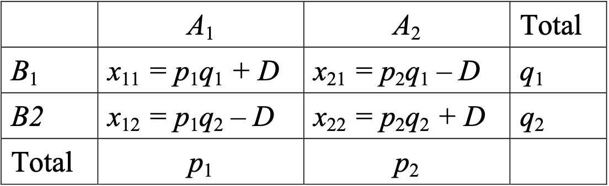
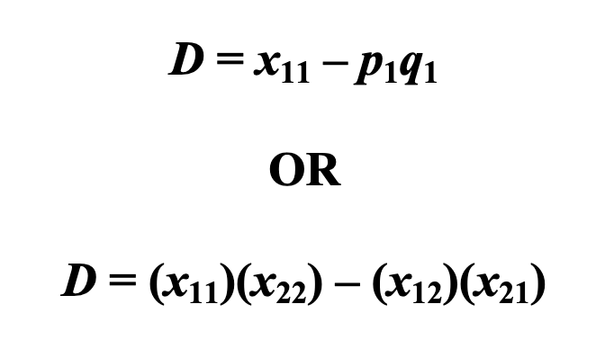

## Mendelian Disease and Rare Variance

SNVs are paramount in genotyping genetic variants, grouping afflicted populations in GWAS and for understanding mutational mechanisms.

Using sequencing data from **Whole Exome Sequencing** (WES) or **Whole Genome Sequencing** (WGS), you can filter for these SNVs to identify rare variants related to **germinal disease**. 

When assigning these rare variants to phenotypes, one must consider the effects of both environment and genomic variaton. One way to more easily discern the possibility of germinal inheritance within families is the following:

Relative risk
: To quantify the **number of cases** within a group of relatives, compared to a **control** and calculate the **hypothetical risk** of germinal disease between relatives.  

  ==RR(Relative Risk)== = (**a / z**) / (**c / y**)

**a**: relatives cases, **z** total relatives, **c** total cases in the population, **y** total individuals in the population

| MIAULER | Cases | Controls | Total |
| ----------- | -------- | -------- | -------- |
| Relatives  | a | b | z |
| General Population | c | d | y |

In regard to **twins** within a group of relatives, or twin patients, you can determine the **concordance rate** of **germinal disease**; the chance of germinal disease between twins.

This measurement differs between **monozygous and dizygous twins**. That is to say, **monozygous twins* have a higher **concordance* rate, owing to their sharing more of the genome than dizygous.

* **Environmental factors** mean that ==monozygous twins== can **never** have a **100%** concordance rate.  

**Segregation study**
: A segregation study concerns the use of historical data in ascertaining patterns. In our case, it would be used to satisfy a **hypothesis** on the transmission rate for a germinal disease within a familial lineage.

This is tricky:
* Due to lack of medical history records.
* Phenotype onset (can vary between people). 
* Phenotype being overshadowed by other ailments.
* People dying before the disease can present itself. 

Common theme? Complicating levels of **Heterogeneity**.

Side note; 

Mendelian Disease
: Autosomal dominant disease, autosomal recessive disease, X-linked recessive disease and X-linked dominant disease

When **allele frequency is low**, but disease impact is high, this is usually associated with **Mendelian Diseases**.

Whereas, if **allele frequency is high**, you have **common** diseases which can frequently present themselves within the larger population and are therefore larger **targets for GWAS**.

## Common Variance and GWAS

When one wants to analyse **common variance** within a population, **single nucleotide polymorphisms** are a critical clinical target. 

Each phenotypic SNP should be characterised by:
* **Minor Allele Frequency** (**MAF** = the number of times its present within a population within a certain allele**): A MAF value associated with a common variant should exceed >1%, while rare variants should lie at <1%.
* **rs number** (= a unique identification number for the SNP).

**Illumina* is most commonly used for **genotyping**. However, depending on the **sample size* among other factors, other technologies might be preferred.   

In **beadchip* DNA sequencing (**Illumina**), the sequence (not just the one attached) most proximal to the bead, will be the one containing the SNPs. Remember that initially hybridisation must occur between the beads and the DNA sequences of interest, which then be sequenced extending from the bead.  
With each nucleotide addition during sequencing, the **bead will emit fluorescent light* which is picked up then blah blah.

## SNP Analysis

 Following sequencing etc, one must then identify the **Linkage Disequilibrium (LD)**;   

LD
: The **non-random** association of a number of alleles due to their **proximity on the same chromosome/locus** and thereby subsequent **co-inheritance**, *despite recombinatory events chromosomes undergo*.

Mathematics of LD as presented in NCBI
: **D = p A B − p A p B** , where ***pA and pB*** represent the **frequencies of alleles A and B**, respectively, and ***pAB*** is the **frequency of the two-locus haplotype** containing alleles A and B.

What does this mean?

   
Another explanation:
  : Say you have **SNP1* with Allele 1 and 3, and **SNP2* with allele 2 and 4. The genotype for **SNP1* therefore will be Al1/Al2, Al1/Al1 and Al2/Al2. The genotype for **SNP2* will be Al4/Al2, Al4/Al4 and Al2/Al2  
    **Haplotype**: Al/Al2, Al1/4, Al3/Al2, Al3/4  
    So you must calculate the **Dgt \= observed frequency \- theoretical frequency* of the haplotype genome type. To normalise this value, you would calculate the **r value squared**. (add from ppt)  

For an **LD* to be statistically significant, usually you want an **r squared* equal to or above **0.8**.  

**LD* can decrease depending on the **genetic disease type* or even the **recombination* rate. 
 
 Hapmap, **ensemlb* and 1000genomes are databases which contain **SNPs* and their related **LD* values.

## SNPs in GWAS

 Analysis which concerns the **entire genome**, studying the **association** of **SNPs** across an entire genome.  
 To test association of SNPs alleles with one disease or one phenotype using a group of patients ‘cases’ and a group of healthy people ‘controls’.

Cases  
: Sample from a single ethnic population and not related. Homogeneous disease phenotype, characterised with acknowledged international clinical criteria  

Controls
: Without disease or phenotype. Sample from a single ethnic population, same as for cases. Sample not related to each other and to cases. Matched to cases concerning sex ratio and **age (account for onset)** GWAS can help identify SNPs and their relation to genetic disease onset: One must **replicate** the analysis to replicate and **confirm the results**. Also, using **LD* you must determine if the **SNPs* are causal or just correlated. What interaction is there between SNPs?

## Rare variants

Depending on their frequency, one should pay attention to the **SNPs* with **MAFs* of **below 0.1%**, **NGS* allows us to sequence alleles and determine the frequency of SNPs within a population of samples.  
This process later involves **filtering* of sequenced genomes, to highlight the **rare SNPs**.  
The presentation has good graphs on this  
**Haplotype caller**: Detect regions with variations ,which can help identify haplotypes, then estimate their probability and deduce the **genotype of alleles which give rise* to the haplotypes.

