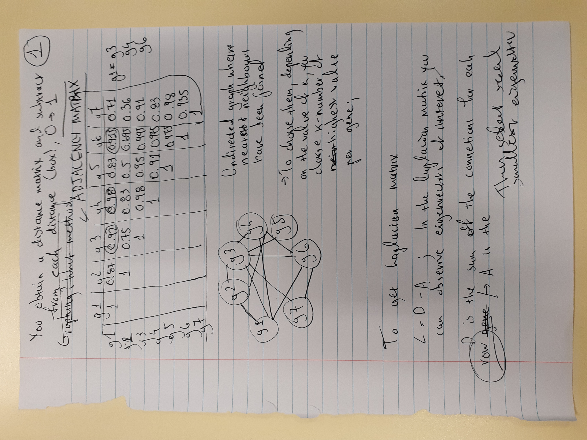

## Spectral Clustering

* **Convex cluster**: Basically, in a convex cluster, you can **draw a straight line from any point in the cluster to any other point in the cluster without leaving the cluster**. For example, a U-shaped cluster would not be convex because you could not draw a straight line from one end of the U to the other without leaving the cluster and crossing across empty space.    

## Eigenvalues and(/or) eigenvectors: Additional theory.

Eigenvectors are the vectors which following a linear transformation of the points within a matrix, **eigenvalues** shall remain the same;

Given the picture of a vector space which you could equate to the fabric of time in space, a **linear transformation** would would change vector positions in an "**equal distribution**" of sorts. 

If we were to represent vectors within this vector space as points on a graph, which are connected to their x and y intercepts with a line, during a linear transformation **all of these lines** should remain parallel.

Or in other words, in a linear transformation, when calculating the distances between vectors, **distance should remain the same before transformation occured**. 

**Eigenvectors** are those which despite a linear transformation **do not** "change their position" following transformation, like anchor points in the "fabric of time".

## Degree, Adjacency and Laplacian Matrices

### Degreee Matrix
A **Degree** Matrix is an integral part of graph theory, and is a matrix representation of an undirectional graph; 

Specifically, a Degree matrix has the **number of connections** of **each point** in ***succesive order***, on the ==**diagonal**== of the matrix. (See Wikipedia screenshot)

### Adjacency Matrix
To start with, we are not required to learn how to compute weights to generate an Adjacency matrix; it's either given to us, or we **assume** that a **connection is 1 and non is 0**.

