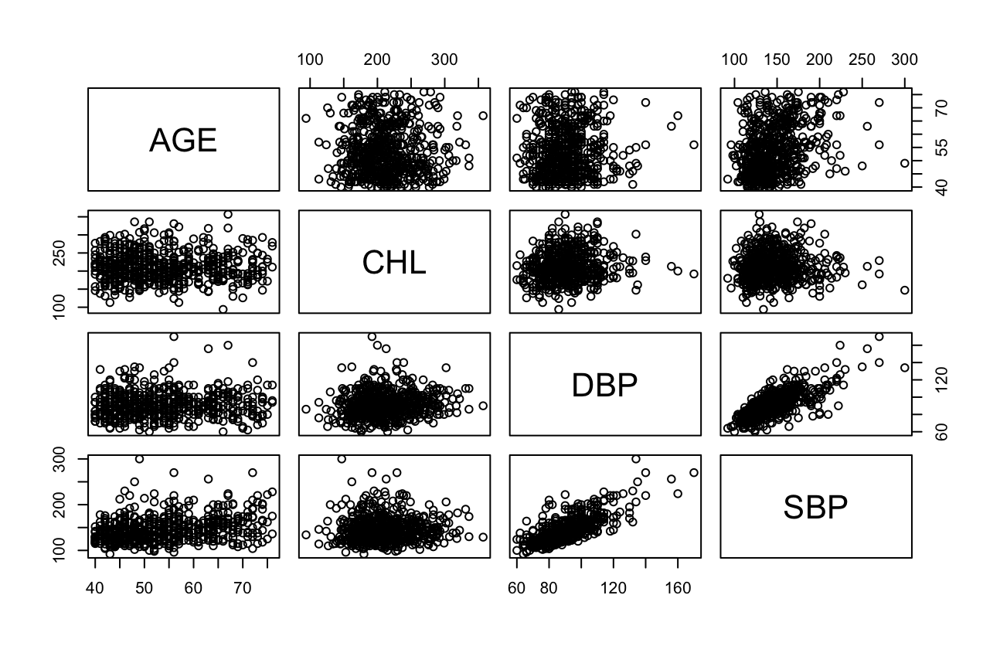
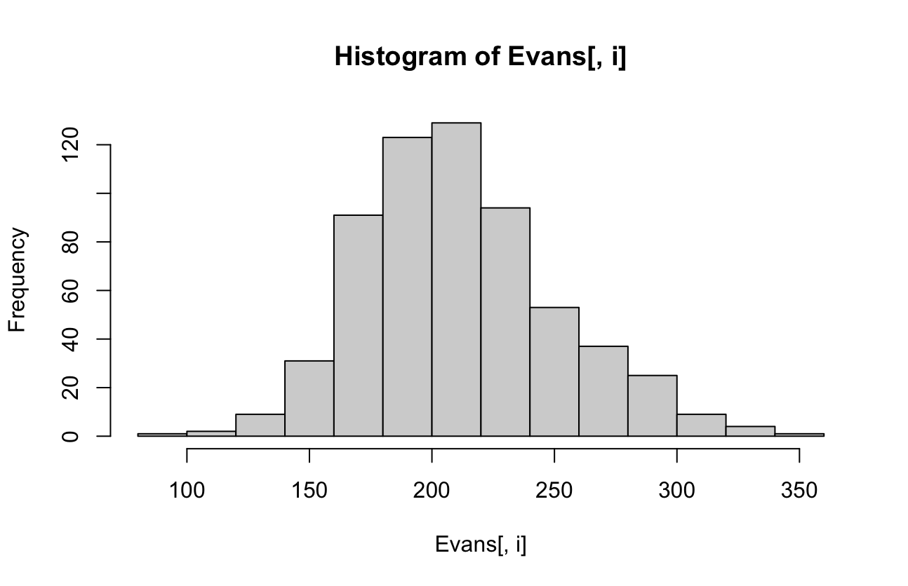
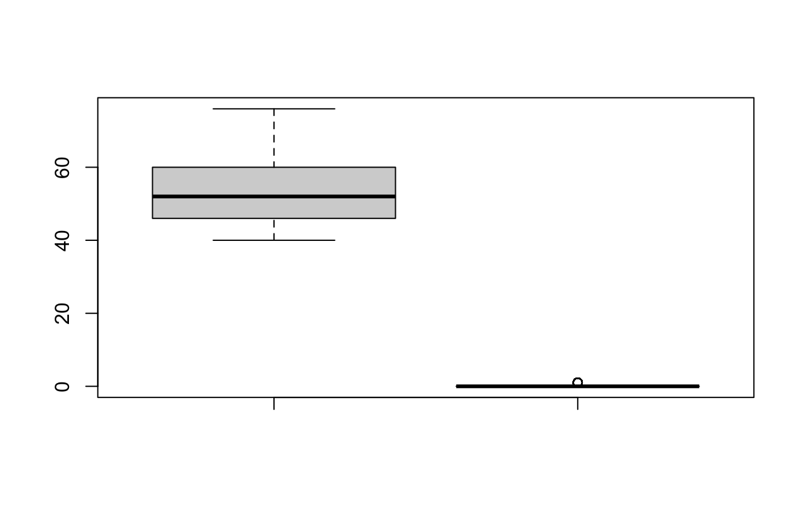
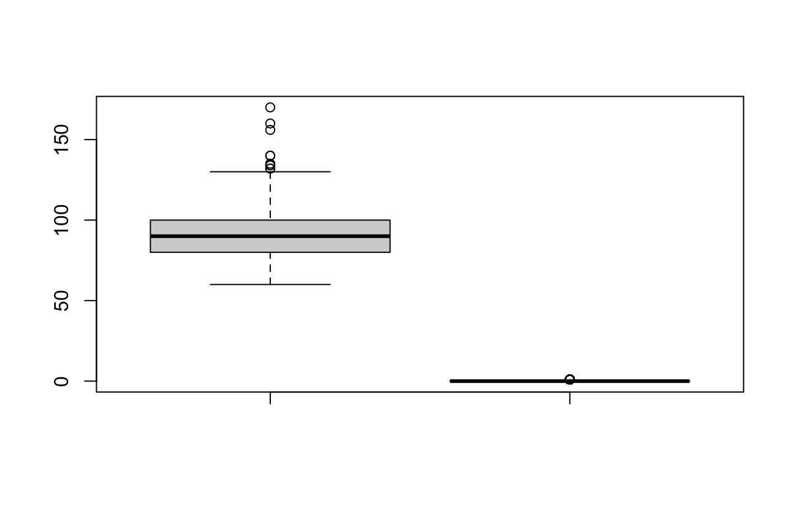

# Learning statistics under pressure

## Simple stats; TD1

### Linear Regression: A linear model.

**Simple Linear Regression**, or a **Multiple Linear Regression**:

#### Simple Linear Regression

Does *height* influence the **weight** of a person?

* One independent variable and one dependent.

#### Multiple Linear Regression

Do *height* and *gender* influence the **weight** of a person?

* **two independent** variables and one dependent.

Key:
**Dependent** variable
*Independent* variables

## Simple Linear Regression (SLR): Formula and theory.

The aim of this statistical prediction model is to identify a relationship between **two** sets of data; 

This would graphically be represented with a linear equation:

### $y = b * x + a$

*Where*:

$y$ is the **dependent/expected** variable
$b$ the **slope**
$x$ the **independent** 
$α$ the **y-intercept**

Alpha and Beta are termed **regression coefficients**, the unknown values which **influence** the predictor values.

When we have what appears to be a linear relationship, in order to properly classify it, we must attempt to locate the best possible fit/line between all points. The **distance** between the predicted line and the data points which are correlated, is called the **residual**, the **ERROR**, represented by **epsilon**; $ϵ$.

### SLR formula: $Y=f(X,β)+ϵ$
Where:

Y is the response, or **dependent** variable;
$f$ is some mathematical function;
X is a matrix of predictor (**independent**) variables;
$β$ are the model parameters;
$ϵ$ is the random error term ==(in modelling: a **residual**)==.

You would use this statistical model to characterise a **linear relationship** between given sets of values.

When calculating the line of best fit, you want to discover the value of the coefficients, alpha and beta, using the **Ordinary Least Squares** method. 

#### In R:

```R
model <- lm(dependent~predictor, data = dataset)
```

Replace dependent with your dependent variable, predictor with an influencing independent variable and dataset...

### Multivariate regression (MLR): Formula and theory.

Not to be confused with multiple regression, you now have **multiple** dependent variables (aka, criteria) instead of one:

* Here, you have the culmination of x mount of regression models, to reach a conclusion on x amount of criteria.

Therefore, you would have the following transformation of the formula:

 $ SLR = y = b * x + a$
==>
### $ MLR = y = b_1 * x_1 + b_2 * x_2 + ..... + b_9 * x_9 + a$ 

Where the SLR formula would be calculated once per independent variable ($y$), for a single dependent, you know have multiple instances of dependents ($ b * x $) calculated for the **influence** a ***single independent variable*** has on them. (There can be many independent variables still)

### Coefficient of determination and standard error: R^2^ and STDEV

$R^2$ represents the **proportion of variance** wihtin a data set. Alongisde STDEV, it can help determine if the data is for one, **correlated** and by extension, represented through a liner relationship.

Say we have a dataset which contains hours studied, exam score and preparation exams taken.

Score is our dependent variable (criteria) and the independent variables are the hours and prep exams taken.
```R
df <- data.frame(hours=c(1, 2, 2, 4, 2, 1, 5, 4, 2, 4, 4, 3, 6, 5, 3),
                prep_exams=c(1, 3, 3, 5, 2, 2, 1, 1, 0, 3, 4, 3, 2, 4, 4),
                score=c(76, 78, 85, 88, 72, 69, 94, 94, 88, 92, 90, 75, 96, 90, 82))

# Or:

data <- load("path_to_data.RData") #Usually the information in these files should be in dataframe format.
df <- data

# If an RData file doesn't already format its data into dataframes:

df <- as.data.dataframe(data) 

#Now you need to create a linear model

model <- lm(score~prep_exams+hours, data = df)  

summary(model) #Or, if you only want to see the RSquared you can do the following: summary(model)$r.squared
```

#### A note on $R^2$:

Normally, you would want an $R^2$ which is **above** ==**0.9**== for a perfectly fitting linear model. However, depending on the quality or ==variance== of the data, you *could accept anything above 0.5*; ***along as the p-value is below 0.05***.

### Using the lm (linear model) function:
```R
model <- lm(dependent_variable~predictor+predictor, data = df) 
```
Where: 
* The criteria (**dependent variable**) is placed before the **"~"**
* The predictors (**independent variables**) are placed after the **"~"**, if there are multiple, use a **"+"** to join them.
* Data should be **assigned** to the **dataframe**.

#### Assumptions for linear models

* Linearity: There must be a linear relationship between the dependent and independent variables.
* Homoscedasticity: The residuals must have a constant variance.
* Normality: Normally distributed error.
* No multicollinearity: No high correlation between independent variables; where it is too difficult which independent variable is affecting the dependent the most.

### Obtain OLS estimators; model parameter, the β~x~ (β-hat).

To obtain 
\[
\hat{\boldsymbol{\beta}} = \left( \mathbf{X}^\text{T} \mathbf{X} \right)^{-1} \mathbf{X}^\text{T} \mathbf{y}
\]

In a way you could say, this is the method by which you can identify the **slopes** of your **dependent variables**; your **criteria** (predictors).

To reproduce this in R:
```R
X <- #Your dependent variable here
y <- #Your independet variable here
ur_hat_beta <- solve(t(X)%*%X%*%t(X)%*%y)
```
### T-test
The t-value is either produced by calling **summary()** on your model, or can be done manually;

In the following function, you can perform a **one sample** t-test.
```R
t.test(your_variable, mu = X)
```
Where your_variable relates to either an independent or dependent variable and **mu** is the *hypothesised mean for your population*; a metric for analysing the null hypothesis.

For **multiple sample** t-tests, replace parts of code as required:
```R
t.test(dependent_variable ~ independent_variable, data = ur_dataframe)
```


### ANOVA

Short for Analysis Of VAriance, this method of data analysis attempts to first elucidate ***variability*** *within groups of data* (within a *single* quantitative variable) to then observe observe the **variability** ***between*** groups of data.

Group: a dataset where our dependent variable could correlate to the independent variable and of which variance, is also ==**normally distributed**==

A study can (will certainly) have multiple independent variables and therefore **different groups** are made to measure the effect of these independent variables to our dependent variable of interest.

Take the following dataset, where we have three groups, each defined by a different value for the independent variable:


To make this data meaningful, lets create a dotplot:


Here Yx refers to the ***mean of the dependent variable measurements*** within each independent variable group, x relates to the **alphabetical equivalent** and is assigned to the aforementioned groups.

In the boxplot we observe:

- Significant variance **within** each groups' dependent variable.
- The mean for each groups' dataset is rather similar **between** them.

Performing an ANOVA test using R, we get the following:


Drawing attention to the **p-value**, we can determine that there is a significant correlation between our independent variable and in fact all independent variables display a "coordinated" effect on our dependent variable.

**Just use the p-value to reject the null hypothesis**.

In R, this translates to:
```R

model_for_ANOVA <- lm(variable_x ~ 1, data = ur_dataframe)
your_model <- lm(variable_x ~ variable_y, data = ur_dataframe)

anova(model_for_ANOVA, your_model)
```
To obtain the **residuals**, the error, by means of your model comparison:

```R
variable_xy <- 3.4
predict(your_model, data.frame(variable_x =variable_xy))
```

## Workings and explanations of TD2

### Initialisation
```R
library(lbreg)
library(Epi)
library(MASS)
library(ROCR)

data("Evans")
```
With the above code you can load your datasets and analysis libraries, onto the R project you have initiated. 

Importantly, from the libraries you have loaded, you can assign your desired dataset to a variable using:

`data(XYZ)`

No need to do:

` data <- (XYZ)`

### summary(dataset): Get an idea
In our case:
```R
summary(Evans)
```
Without setting any particular parameters after the dataset name (dataset, xyz), R will return all possible measurements the function can perform, for each variable within our dataset.
```R
 CDH              CAT              AGE             CHL             SMK        
 Min.   :0.0000   Min.   :0.0000   Min.   :40.00   Min.   : 94.0   Min.   :0.0000  
 1st Qu.:0.0000   1st Qu.:0.0000   1st Qu.:46.00   1st Qu.:184.0   1st Qu.:0.0000  
 Median :0.0000   Median :0.0000   Median :52.00   Median :209.0   Median :1.0000  
 Mean   :0.1166   Mean   :0.2003   Mean   :53.71   Mean   :211.7   Mean   :0.6355  
 3rd Qu.:0.0000   3rd Qu.:0.0000   3rd Qu.:60.00   3rd Qu.:234.0   3rd Qu.:1.0000  
 Max.   :1.0000   Max.   :1.0000   Max.   :76.00   Max.   :357.0   Max.   :1.0000  
      ECG              DBP              SBP             HPT        
 Min.   :0.0000   Min.   : 60.00   Min.   : 92.0   Min.   :0.0000  
 1st Qu.:0.0000   1st Qu.: 80.00   1st Qu.:125.0   1st Qu.:0.0000  
 Median :0.0000   Median : 90.00   Median :140.0   Median :0.0000  
 Mean   :0.2726   Mean   : 91.18   Mean   :145.5   Mean   :0.4187  
 3rd Qu.:1.0000   3rd Qu.:100.00   3rd Qu.:160.0   3rd Qu.:1.0000  
 Max.   :1.0000   Max.   :170.00   Max.   :300.0   Max.   :1.0000
```
#### Understanding the summary() function:
```R
      CDH 
 Min.   :0.0000
 1st Qu.:0.0000 
 Median :0.0000  
 Mean   :0.1166    
 3rd Qu.:0.0000 
 Max.   :1.0000 
```
Above we have the first column of measurements on the CDH variable, which is a **binary variable** (==Boolean==):

That is, a **categorical variable** which can take either a *True* (1) or *False* (0) value; in the case of CDH (Coronary Heart Disease), one can either have it '*1*', or not have it "*0*".

As such, the "**Min**"= 0, "**Max**" = 1 and the 1st and 3rd Quartiles are 0?

1st Quartile
: The 1st Quartile is the average of the first/**lowest** **25% of values in the distribution**. So, imagine it as the area within the curve which is adjacent to coordinates 0,0 and ends before the median.

2nd Quartile
: This represents the **middle** 50% of values; if you take the ***average of those, you get the median***. 

3rd Quartile
: The 3rd Quartile is the **average of the 75% of the values** (vectors), from *lowest to highest*, within a distribution. As such, imagine it as the area covering both the 1st Quartile and the median, thereby the average of both, altogether. 

How can the 3rd Quartile be 0?
: In a **Boolean** variable, the 4th Quartile (100th Percentile) is where the money is at, the area at which maximum values are represented. When account for 75% of the data from lowest to highest, maximum values are diluted and underrepresented. 

Can also use head(Evans, num=x) to see the x amount of first rows in the data, if num is null, 6 is the default

### Gaining access to variable names and structure

Using the **"str"** function, you gain an idea of the values associated to each variable in the dataset:

```R
str(Evans)
```
#### Output:
```R
'data.frame':	609 obs. of  9 variables:
 $ CDH: int  0 0 1 0 0 0 1 0 0 0 ...
 $ CAT: int  0 0 1 1 0 0 0 0 0 0 ...
 $ AGE: int  56 43 56 64 49 46 52 63 42 55 ...
 $ CHL: int  270 159 201 179 243 252 179 217 176 250 ...
 $ SMK: int  0 1 1 1 1 1 1 0 1 0 ...
 $ ECG: int  0 0 1 0 0 0 1 0 0 1 ...
 $ DBP: int  80 74 112 100 82 88 80 92 76 114 ...
 $ SBP: int  138 128 164 200 145 142 128 135 114 182 ...
 $ HPT: int  0 0 1 1 0 0 0 0 0 1 ...
```
Using the **"names"** function, you get all variables printed in the output; you can use these names as **arguments** in downstream analysis.

```R
names(Evans)
```
#### Output:
```R
[1]"CDH" "CAT" "AGE" "CHL" "SMK" "ECG" "DBP" "SBP" "HPT"
```

### Creating a scatter plot: getting an idea of the data.

To create pairwise scatter plots use the following method and place variable names as needed. Remember that you OBVIOUSLY **shouldnt** be using **scatter plots** for **categorical variables**:

```R
pairs(Evans[, names(Evans)])
```
#### Output:


Reminder
: The plot on the ==right of AGE==, has ***AGE on the y-axis and CHL on the x-axis***. 

  When reading the rest of the graphs, remember that *left is y-axis and down is x-axis*.

Why is this useful?
: Using this function you will receive multiple scatter plots attempting to **represent possible "pairwise" correlation between two variables**: if not, you just observe the *distribution of the data points of each variable* on their own.

### Generating histograms

Imagine a histogram as a bar chart, of which bars are canonically termed as "**bins**". The purpose of a histogram is to represent the distribution of a dataset, this is useful as you can:

* Observe whether the distribution of a dataset is **normal** (**Gaussian**) or not.
* You can observe **bin outliers**, or peaks, in the distribution, which could be intriguing in the analysis.

To create a histogram:
```R
hist(plot_title[x_axis_values, y_axis_values])
``` 

Or more specifically for TD2:
```R
for(i in names(Evans)) {
  hist(Evans[, i])
}
```
#### Output:
*AGE*: Skew right

*CHL*: Nearly Unimodal

*SBP*: Skew right

*DBP*: Skew right


From the resulting graphs, use this rubric to characterise the distribution of each variable correctly:


### Generating boxplots

Boxplots are useful to determine distribution of data between different variables, therefore you would use boxplots to determine variable spread, statistical calculation of the spread for each box and possible relationships in the spread of data.

Here we are creating boxplots to visualise the spread of each variable in the list, compared to CDH data:
```R
for(i in names(Evans)) {
  boxplot(Evans[, i],Evans$CDH, data = Evans)
}
```
#### Output:
*AGE*:

*CHL*:

*SBP*:

*DBP*:


### Generating contigency tables

Contigency table
: A type of table in matrix format, which displays multivariate frequency distribution in the provided variables. 

With regard to TD2, we can **directly compare the data** available for each of our binary variables against CDH (Coronary Heart Disease); looking at the **effect of these contributing factors, to CDH**:
```R
for(i in c("CAT", "SMK", "ECG", "HPT")) {
  print(table(Evans[,"CDH"],Evans[, i]))
}
```
#### Output:
```R
      0   1
  0 443  95
  1  44  27
   
      0   1
  0 205 333
  1  17  54
   
      0   1
  0 401 137
  1  42  29
   
      0   1
  0 326 212
  1  28  43
```
We can also place the above information into **stacked** **barplots**, looking at the distribution of CDH compared to our list of variables:
```R
for(i in c("CAT", "SMK", "ECG", "HPT")) {
  barplot(table(Evans[, i], Evans$CDH))
}
```
#### Output:
In the following "easy to make barplots" at **position 0 of the x-axis** we observe the **proportion of i** (index in list) which **has CD (==1~Gray==)**, or **doesnt have (==0~Dark gray==)** CDH. 

Whereas at **1 on the x-axis**, we get a stacked bar representing the number of 1s and 0s for CDH as a whole.

*CAT*:

*SMK*:

Here we observe the highest ***proportional correlation*** between **smoking** and **coronary heart disease**.
*ECG*:

*HPT*:


### Chi squared test: Qualitative Variables, testing proportional correlation.

Upon suspicion of *correlation between dependent and independent variables*, even to test that the proportions seen between dependent variables are **not random**, one would use a chi squared test. 

Given the example of the Evans dataset, we have already observed a possible correlation between CDH and smoking (SMK); what we want to do is now disprove the null hypothesis (no correlation; random chance) and accept the possibility of correlation between CDH and SMK.

Particularly, this test relates to goodness of fit-testing, where fit can be the **model** we have created between two variables.

```R
#Fit the model Evans to test the association between the data in the columns CDH and SMK
chisq <- chisq.test(Evans$CDH, Evans$SMK, correct = FALSE)

print(chisq)
```
#### Output:
```R
Pearson's Chi-squared test

data:  Evans$CDH and Evans$SMK
X-squared = 5.4293, df = 1, p-value = 0.0198
```
We obtain the X-squared, but above all, the **p-value for false positive discovery**. In our case, the **p-value is significantly low**, therefore a ***possibly causal relationship***.

Note: The null hypothesis can differ depending on the analysis we are conducting.

### Generalised Linear Model: No Gaussian Distribution.

Probability density functions are used to compute the probability by which a pre-existing distribution of our dataset could occur in a larger population etc. In other words, the ***probability density functions give us our p-values***.

In a **poisson** distribution, where the distribution is not normal, or **not Guassian**, even if the means between a normal distribtion and poissson distribution are the **same**, a **specific** method of analysis is required to **avoid error**.

==**Generalised linear models**== are particularly important when trying to calculate correlation probability (*"depndent distribution probability"*) for datasets which involve **binary variables**: 

Take for example the Evans dataset, which plots Coronary Heart Disease (CHD) amongst a range of contributing factors, **including smoking status**, which is ***another binary variable***. 

In these instances, you **will not**, **OBVIOUSLY**, have a normal distribution; you will instead encounter a **Poissson** distribution:


Or, other examples include variables which can only assume **specific values**; 

Ex. How much do I want to shit myself:

```
- 25%
- 50%
- 75%
- 100%
```
The "Shit priority graph" will **not** be normally distributed as there is very **constrained variability** in the data.

Poisson distribution
: Categorical variables which can assume different states in a ***non-binary fashion***; variables with **discrete** values to convey different states of the categorical value.

#### Using GLM in TD2:
We have already seen that there is a possible **causal relationship** between smoking and CDH.

To further explore this, we create a ***generalised linear model*** to observe the possibility for this **relationship existing in larger populations**; 

Since the distribution is **not Guassian**, as our variables **respond to "yes" or "no"** (==**binomial distribution**==), we have to ***adjust the "family" parameter accordingly***:
```R
glm <- glm(CDH ~ SMK, data = Evans, family = binomial)

summary(glm)
```
#### Output:
```R
Call:
glm(formula = CDH ~ SMK, family = binomial, data = Evans)

Coefficients:
            Estimate Std. Error z value Pr(>|z|)    
(Intercept)  -2.4898     0.2524  -9.865   <2e-16 ***
SMK           0.6706     0.2919   2.297   0.0216 *  
---
Signif. codes:  0 ‘***’ 0.001 ‘**’ 0.01 ‘*’ 0.05 ‘.’ 0.1 ‘ ’ 1

(Dispersion parameter for binomial family taken to be 1)

    Null deviance: 438.56  on 608  degrees of freedom
Residual deviance: 432.81  on 607  degrees of freedom
AIC: 436.81

Number of Fisher Scoring iterations: 5
```
#### Dissecting the output message

##### Terms:
- ==**Intercept**==: simple maths, its the **predicted outcome** of our **dependent variable**, ***==IF== the independent variable is 0***. 
  - In other words, it demonstrates *what the dependent variable will look like* if the independent has **no effect** on it.
    - While a **negative intercept** does exceeds the **minimum for our data range**, it ***does not negate*** the existence of a positive correlation between dependent and independent.
- ==**Z-value**==: the ==Wald statistic==, where **z demonstrates the deviation of values from the dataset's mean**. 
  - If the **z-value is 0**, there is **no deviation** of the value **from the mean** and as such no variance.
  - **Positive or negative values** are if the value is **deviating higher or lower than the mean**, ***respectively***.
- ==**Null and Residual Deviance**==: how well the dependent variable can be predicted by a model which only has an intercept term and how well the dependent variable can be predicted by the independent variables. **??!!!!???!!???!**
  - Once the null and residual deviance are relatively **similar**, one can use this information to **confirm the validity of our model**. 
- ==**Degrees of freedom**==: Allow us to interpret the applicability of our model. Degrees of freedom can be seen as representing the ***amount of values which can vary*** within our model, ***WITHOUT it affecting the fit of the model***. 


##### Main take-aways:

As we can see from the coefficient estimates, the **independent decreases, as the independent decreases** (see intercept value), ***opposite applies*** for the outcome (CDH), when the **independent increases**.

- ==Most important==: the **p-value**, in this case it shows that for a model where SMK is the predictor, there is a statistically significant correlation between SMK and CDH.

Additionally, keep note of the **AIC** value, which will determine the relative **fitness** of our model, compared to others; the model with the ***smallest AIC*** for our dataset, is the ***most fit model***.

### Odds Ratio

If we have A and B factors which influence each other, the **odds ratio** is a metric of the ***chances*** that for example, ***A will occur, in the presence of B***. 

- If the ==odds ratio is **above 1**==, then A and B are ==**correlated**==; as A will **not occur** in the absence of B, the same applies for the inverse.
- If the ==odds ratio is **below 1**==, then A and B are ==**not correlated**==; as A is believed to **occur** in the absence of B, the same applies for the inverse.

#### Calculating the Odds Ratio:

In this example, we attempt to determine the odds ratio between the CDH and SMK variables. We assign the function to oddsratio:

```R
oddsratio <- exp(coef(glm)[2])
print(oddsratio)
```
#### Output:
```R
    SMK 
1.955485 
```
Here we observe a significantly high odds ratio for the effect of SMK on CDH; indicative of a **strong correlation** between CDH and SMK. 

### Twoby2 analysis

Having seen that SMK and CDH are highly correlated, with a very significant odds ratio, the `twoby2()` function identifies the **inverse** of what was discussed for odds ratio;

- What are the odds that A will occur if B exists? Will A occur if B doesnt exist?

This function produces a **two by two** matrix of **odds ratios** to create this comparison:
```R
twoby <- twoby2(Evans$CDH, Evans$SMK)
print(twoby)
```
#### Output:

```R
$table
    0   1      P(0) 95% conf.  interval
0 205 333 0.3810409 0.3409353 0.4228374
1  17  54 0.2394366 0.1543549 0.3519004

$measures #A table of odds ratios
                                       95% conf.  interval
             Relative Risk: 1.5914061 1.03696034 2.4423049
         Sample Odds Ratio: 1.9554849 1.10347687 3.4653388
Conditional MLE Odds Ratio: 1.9534909 1.07981267 3.6970967
    Probability difference: 0.1416043 0.02362081 0.2356081

$p.value
[1] 0.02160410 0.02512261
```
- As evidenced by the **p-values** which refer to the ***null hypothesis that Odds Ratios (OR)=1***, the values are below the 0.05 threshold, evidencing that the ==**ORs are NOT RANDOM**==.


## TD2 in less detail:

### Investigating the effect of HPT on CDH:
#### Chi-squared:
```R
chisq2 <- chisq.test(Evans$CDH, Evans$HPT, correct = FALSE)
```
#### Output:
```R
Pearson's Chi-squared test

data:  Evans$CDH and Evans$HPT
X-squared = 11.536, df = 1, p-value = 0.0006825
```
#### GLM:
```R
glm2 <- glm(CDH ~ HPT, data = Evans, family = binomial)
print(glm2)
```
#### Output:
```R
Call:  glm(formula = CDH ~ HPT, family = binomial, data = Evans)

Coefficients:
(Intercept)          HPT  
    -2.4547       0.8593  

Degrees of Freedom: 608 Total (i.e. Null);  607 Residual
Null Deviance:	    438.6 
Residual Deviance: 427.2 	AIC: 431.2
```
- The intercept is ***negative*** = *good fit*, HPT is ***positive*** = *good fit*
- The AIC is lower than our other models; keep this in mind.

Corroborating this information with the output of the chi-squared test, we can accept this model, but should continue downstream analysis;
#### ORs:
```R
oddsratio2 <- exp(coef(glm2))
print(oddsratio2)
```
#### Output:
```R
HPT 
2.361523
```
A significantly larger OR between CDH and HPT, maybe SMK is a confounding factor? Considering SMK and CDH are correlated, are SMK and HPT equally correlated to CDH or is there a difference?

#### Twoby2 comparison:
```R
twoby_2 <- twoby2(Evans$CDH, Evans$HPT)
print(twoby_2)
```
#### Output:
```R 
$table
    0   1      P(0) 95% conf.  interval
0 326 212 0.6059480 0.5639932 0.6463968
1  28  43 0.3943662 0.2880346 0.5117372

$measures
                                      95% conf.  interval
             Relative Risk: 1.5365109  1.142611 2.0662021
         Sample Odds Ratio: 2.3615229  1.423207 3.9184679
Conditional MLE Odds Ratio: 2.3581041  1.383977 4.0726310
    Probability difference: 0.2115818  0.087986 0.3244892

$p.value
[1] 0.0008813710 0.0008304074
```

```R
#CDH and HPT, taking into account SMK

glm9 <- glm(CDH ~ HPT + SMK, data = Evans, family = binomial)

summary(glm9)
anova(glm9, glm)

# CDH and AGE as a continuous variable

chisq3 <- chisq.test(Evans$CDH, Evans$AGE, correct = FALSE)

glm3 <- glm(CDH ~ AGE, data = Evans, family = binomial)
summary(glm3)

oddsratio3 <- exp(coef(glm3))

twoby03 <- twoby2(Evans$CDH, Evans$AGE)

# CDH and AGE as a categorical variable

#Can use break or cut function to create the categories

#Let use binary variables to understand if we are in the category (except for the reference)
# x {1 if  (49,59]
#    0 otherwise}
# x {1 if  (59,69]
#    0 otherwise}
# x {1 if  (69,79]
#    0 otherwise}

AGE2 <- cut(Evans$AGE, seq(39,79,10))


chisq4 <- chisq.test(Evans$CDH, AGE2, correct = FALSE)

glm4 <- glm(CDH ~ AGE2, data = Evans, family = binomial)
summary(glm4)

oddsratio4 <- exp(coef(glm4))


twoby04 <- twoby2(Evans$CDH, AGE2)

# CDH, SMK, HPT and AGE

chisq5 <- chisq.test(Evans$CDH, Evans$SMK, Evans$HPT, cut(Evans$AGE, breaks = c(0, 40, 60, 80, 100)), correct = FALSE)

glm5 <- glm(CDH ~ SMK + HPT + AGE2, data = Evans, family = binomial)
anova(glm4, glm9, glm5)

oddsratio5 <- exp(coef(glm5))
#twoby05 <- twoby2(Evans$CDH, Evans$SMK, Evans$HPT, cut(Evans$AGE, breaks = c(0, 40, 60, 80, 100)))

# Perform a variable selection using the step function stepAIC from the MASS package

stepAIC(glm5, direction = "both")
```

## Workings and explanations of TD3

### Initialising the analysis:

Simple R code to load the database from which data is going to be analysed, then perform the first stages of exploratory analysis of the data;
```R
library(ISwR)

#1.1
data(eba1977)
head(eba1977) #or could do str(eba1977) to get a better idea
summary(eba1977)
```
#### Output:
```R
> head(eba1977)
        city   age  pop cases
1 Fredericia 40-54 3059    11
2    Horsens 40-54 2879    13
3    Kolding 40-54 3142     4
4      Vejle 40-54 2520     5
5 Fredericia 55-59  800    11
6    Horsens 55-59 1083     6
> summary(eba1977)
         city      age         pop             cases       
 Fredericia:6   40-54:4   Min.   : 509.0   Min.   : 2.000  
 Horsens   :6   55-59:4   1st Qu.: 628.0   1st Qu.: 7.000  
 Kolding   :6   60-64:4   Median : 791.0   Median :10.000  
 Vejle     :6   65-69:4   Mean   :1100.3   Mean   : 9.333  
                70-74:4   3rd Qu.: 954.8   3rd Qu.:11.000  
                75+  :4   Max.   :3142.0   Max.   :15.000
```
### Pairwise comparison: Pairs()
```R
pairs(eba1977)
boxplot(eba1977$cases ~ eba1977$city)
```
#### Output:
#### Pairs plot

In the pairwise comparison between cases and population, we observe two peaks in the scatter plot; skewed distribution....
#### Boxplot

Here we observe a comparison between cases per, each city on the x-axis. We can observe that some cities have a higher variance of cases but particularly:

- Fredericia and Horsens observe the **same mean**, but have different variance; Horsens has a poisson distribution while Fredericia has a normal distribution??

Let's observe this further.

### GLM and Null-Model, then ANOVA:

Here we want to investigate the correlation between city, cases and a **confounding "age"**. 

We also want to investigate the **null-hypothesis**, to see if cases maintain a **poisson distribution** on themselves;

Specifically, we will then use ANOVA to investigate if variables have a **non-random** distribution and if these variables have an **equally non-random** influence on the **outcome**: the ***cases***.

In ANOVA, we also pair it with a **chi squared test**, to characterise inter-variable correlation (as done in the past).
```R
cases_city <- glm(cases ~ age + city, data = eba1977, family = "poisson")
summary(cases_city)

null_model <- glm(cases ~ 1, data = eba1977, family = "poisson")

anova(null_model, modellc, test = "Chisq")
```
#### Output:
```R
Call:
glm(formula = cases ~ age + city, family = "poisson", data = eba1977)

Coefficients:
            Estimate Std. Error z value Pr(>|z|)    
(Intercept)  2.24374    0.20363  11.019   <2e-16 ***
age55-59    -0.03077    0.24810  -0.124    0.901    
age60-64     0.26469    0.23143   1.144    0.253    
age65-69     0.31015    0.22918   1.353    0.176    
age70-74     0.19237    0.23517   0.818    0.413    
age75+      -0.06252    0.25012  -0.250    0.803    
cityHorsens -0.09844    0.18129  -0.543    0.587    
cityKolding -0.22706    0.18770  -1.210    0.226    
cityVejle   -0.22706    0.18770  -1.210    0.226    
---
Signif. codes:  0 ‘***’ 0.001 ‘**’ 0.01 ‘*’ 0.05 ‘.’ 0.1 ‘ ’ 1

(Dispersion parameter for poisson family taken to be 1)

    Null deviance: 27.704  on 23  degrees of freedom
Residual deviance: 20.673  on 15  degrees of freedom
AIC: 135.06

Number of Fisher Scoring iterations: 5
```

Here we observe that the intercept, in ***respect to specific age groups*** demonstrates a ==***positive***== **intercept estimate** and a ==***positive***== **outcome estimate**.

==Not to mention the horrific p-value estimates==.

Despite the "satisfctory" AIC, the ==model appears to be **unfit**== for demonstrating a **correlation between ages and cases**.

#### Sidenote, the p-value on the last column:

Take $Pr(>|t|) = 0.901$ for ages between 55-59:

This metric essentially **answers the null hypothesis** on the question of what occurs if we were to **remove 55-59 AGE** from the list of variables in our glm. Is our model worse, or better off?

##### If  **$Pr(>|t|) < 0.05$**:

We can say that a **glm involving 55-59 is significantly better than one which doesnt include 55-59**.

However, in our case we can see that 55-59 is NOT a good predictor and our model is primarily dogshit.

```R
Call:
glm(formula = cases ~ 1, family = "poisson", data = eba1977)

Coefficients:
            Estimate Std. Error z value Pr(>|z|)    
(Intercept)  2.23359    0.06682   33.43   <2e-16 ***
---
Signif. codes:  0 ‘***’ 0.001 ‘**’ 0.01 ‘*’ 0.05 ‘.’ 0.1 ‘ ’ 1

(Dispersion parameter for poisson family taken to be 1)

    Null deviance: 27.704  on 23  degrees of freedom
Residual deviance: 27.704  on 23  degrees of freedom
AIC: 126.09

Number of Fisher Scoring iterations: 4
```
The null hypothesis is **proven** as the intercept is **positive**, with a **hugely significant p-value**.
```R
> anova(null_model, cases_city, test = "Chisq")
Analysis of Deviance Table

Model 1: cases ~ 1
Model 2: cases ~ age + city
  Resid. Df Resid. Dev Df Deviance Pr(>Chi)
1        23     27.704                     
2        15     20.673  8   7.0311   0.5333
```
Very **insignificant** chi squared estimate; ==need to redo the model==:

### Correcting the model: changing parameters.

As we have observed that the previous model is misrepresentative of correlation between the variables of interest, we now **add population into the mix**.

Importantly, we **==naturalise== the population values** (==**natural log**==), to account for the **magnitudal difference** between *cases, age and population values*.

The ==**offset**== parametre is important for the LINK function of the GLM; in practice it ensures that the **linear predictor** (*independent-predictor variable*) is **adjusted** for population, when calculating possible outcome.
```R
cases_city_pop <- glm(cases ~ age + city, offset = log(pop), data = eba1977, family = "poisson")
summary(cases_city_pop)

null_model_new <- glm(cases ~ 1, offset = log(pop), data = eba1977, family = "poisson")
anova(null_model_new, cases_city_pop, test = "Chisq")
```
#### Output: 
```R
Call:
glm(formula = cases ~ age + city, family = "poisson", data = eba1977, 
    offset = log(pop))

Coefficients:
            Estimate Std. Error z value Pr(>|z|)    
(Intercept)  -5.6321     0.2003 -28.125  < 2e-16 ***
age55-59      1.1010     0.2483   4.434 9.23e-06 ***
age60-64      1.5186     0.2316   6.556 5.53e-11 ***
age65-69      1.7677     0.2294   7.704 1.31e-14 ***
age70-74      1.8569     0.2353   7.891 3.00e-15 ***
age75+        1.4197     0.2503   5.672 1.41e-08 ***
cityHorsens  -0.3301     0.1815  -1.818   0.0690 .  
cityKolding  -0.3715     0.1878  -1.978   0.0479 *  
cityVejle    -0.2723     0.1879  -1.450   0.1472    
---
Signif. codes:  0 ‘***’ 0.001 ‘**’ 0.01 ‘*’ 0.05 ‘.’ 0.1 ‘ ’ 1

(Dispersion parameter for poisson family taken to be 1)

    Null deviance: 129.908  on 23  degrees of freedom
Residual deviance:  23.447  on 15  degrees of freedom
AIC: 137.84

Number of Fisher Scoring iterations: 5
```
Demonstrates a ==***negative***== **intercept estimate** and a ==***positive***== **outcome estimate**.

Each age group also demonstrates a high p-value to imply correlation between age and cases per city. 

Most **striking**, is the (correlation/false positive chance) p-value for **age group 70-74**.

With a "satisfctory" AIC, the ==model appears to be **fit**== for demonstrating a **correlation between ages and cases, ==when accounting for population==**.
```R
> anova(null_model_new, cases_city_pop, test = "Chisq")
Analysis of Deviance Table

Model 1: cases ~ 1
Model 2: cases ~ age + city
  Resid. Df Resid. Dev Df Deviance  Pr(>Chi)    
1        23    129.908                          
2        15     23.447  8   106.46 < 2.2e-16 ***
---
Signif. codes:  0 ‘***’ 0.001 ‘**’ 0.01 ‘*’ 0.05 ‘.’ 0.1 ‘ ’ 1
```
With the ANOVA test we can **==disprove== the null hypothesis** and **approve our model**, with a *striking p-value of 2.2e-16*.

### Wald test

This statistical test regards hypothesis testing, where if we have outcome x, we want to see how **"extreme"/"detached"** x is, from a null hypothesis ie. x = 0.

Or in other words, how possible is it that the outcome is non-random and the likelihood of x assuming a value>0 is significantly higher than it assuming zero.


```R
#The P value of the summary corresponds to the Wald test 
#The P value of the anova corresponds to the Likelihood ratio test

#you could define the categories as indicative functions and test the model again and it would give you the same results

age55 <- (eba1977$age=="55-59")
age60 <- (eba1977$age=="60-64")
age65 <- (eba1977$age=="65-69")
age70 <- (eba1977$age=="70-74")
age75 <- (eba1977$age=="75+")

modellc4 <- glm(cases ~ age55 + age60 + age65 + age70 + age75 + city, offset = log(pop), data = eba1977, family = "poisson")
modellc5 <- glm(cases ~ age55 + age65 + age70 + age75 + city, offset = log(pop), data = eba1977, family = "poisson")
anova(modellc4, modellc5) #This gives also the Wald test on age 60-64 DOESNT WORK YET :((

#1.6
#Compute a 0.95 confidence interval for the effect of age75+ and interpret this result in terms of number of lung cancer cases.

exp(confint(modellc, "age75+", level = 0.95))
confint(modellc3, "age75+", level = 0.95)


beta_hat <- coef(modellc3)["age75+"]
se <- summary(modellc3)$coefficients["age75+", "Std. Error"]
#se1 <- sqrt(vcov(modellc3)["age75+", "age75+"])
alpha <- 0.05
xi_hat_alpha_beta <- beta_hat*exp(se^2/2)
lower_bound <- exp(xi_hat_alpha_beta - qnorm(1 - alpha / 2) * se)
upper_bound <- exp(xi_hat_alpha_beta + qnorm(1 - alpha / 2) * se)
```
### Prediction function in R
```R
#1.7
#Predict the expected number of lung cancer cases in Kolding for people aged between 60 and 64 (why pop 896)
predict(cases_city_pop, newdata = data.frame(age = "60-64", city = "Kolding", pop=896), type = "response")
```

## Last year's exam

Learn basic formulas involving linear models and generalised linear models, beta coefficient.

He doesnt want us to explain the R code on paper, he wants us to "translate" our code from R into mathematical formulaic fashion. 

### Part 1 - Descriptive statistics

#### 1. Which variables are quantitative ? Which variables are qualitative ?

Quantitative variables: age, lwt, bwt 
Qualitative variables: low, race, smoke, ptl, ht, ui, ftv

#### 2. What can be said about the probabilty distribution of each variable ?

Teacher: Histograms or boxplots
```R
birthwt <- read.csv("/Users/chrismitsacopoulos/Downloads/birthwt.csv")

data <- birthwt[-1]
summary(data)
```
##### Output:
```
low              age             lwt             race           smoke       
 Min.   :0.0000   Min.   :14.00   Min.   : 80.0   Min.   :1.000   Min.   :0.0000  
 1st Qu.:0.0000   1st Qu.:19.00   1st Qu.:110.0   1st Qu.:1.000   1st Qu.:0.0000  
 Median :0.0000   Median :23.00   Median :121.0   Median :1.000   Median :0.0000  
 Mean   :0.3122   Mean   :23.24   Mean   :129.8   Mean   :1.847   Mean   :0.3915  
 3rd Qu.:1.0000   3rd Qu.:26.00   3rd Qu.:140.0   3rd Qu.:3.000   3rd Qu.:1.0000  
 Max.   :1.0000   Max.   :45.00   Max.   :250.0   Max.   :3.000   Max.   :1.0000  
      ptl               ht                ui              ftv              bwt      
 Min.   :0.0000   Min.   :0.00000   Min.   :0.0000   Min.   :0.0000   Min.   : 709  
 1st Qu.:0.0000   1st Qu.:0.00000   1st Qu.:0.0000   1st Qu.:0.0000   1st Qu.:2414  
 Median :0.0000   Median :0.00000   Median :0.0000   Median :0.0000   Median :2977  
 Mean   :0.1958   Mean   :0.06349   Mean   :0.1481   Mean   :0.7937   Mean   :2945  
 3rd Qu.:0.0000   3rd Qu.:0.00000   3rd Qu.:0.0000   3rd Qu.:1.0000   3rd Qu.:3487  
 Max.   :3.0000   Max.   :1.00000   Max.   :1.0000   Max.   :6.0000   Max.   :4990
 ```
We can observe from the non-equal median and average values for the quantitative variables, that the distribution is non-Gaussian. 

Plotting them into histograms:


Distribution tends to skew right for age and low weight, however body weight is more akin to normal distribution.

#### 3. Estimate correlation coefficients. Which variables are the most correlated ?

CORRECT ANSWER
```R
correlation_matrix <- cor(data, method = "pearson") 
print(correlation_matrix)
```
##### Output:
```
    low         age         lwt         race       smoke          ptl          ht
low    1.00000000 -0.11893928 -0.16962694  0.137792751  0.16140431  0.196087267  0.15237025
age   -0.11893928  1.00000000  0.18007315 -0.172817953 -0.04434618  0.071606386 -0.01583700
lwt   -0.16962694  0.18007315  1.00000000 -0.165048544 -0.04417908 -0.140029003  0.23636040
race   0.13779275 -0.17281795 -0.16504854  1.000000000 -0.33903074  0.007951293  0.01992992
smoke  0.16140431 -0.04434618 -0.04417908 -0.339030745  1.00000000  0.187557063  0.01340704
ptl    0.19608727  0.07160639 -0.14002900  0.007951293  0.18755706  1.000000000 -0.01539958
ht     0.15237025 -0.01583700  0.23636040  0.019929917  0.01340704 -0.015399579  1.00000000
ui     0.16904283 -0.07515558 -0.15276317  0.053602088  0.06215900  0.227585340 -0.10858506
ftv   -0.06296026  0.21539394  0.14052746 -0.098336254 -0.02801314 -0.044429660 -0.07237255
bwt   -0.78480516  0.09031781  0.18573328 -0.194713487 -0.19044806 -0.154653390 -0.14598189
               ui         ftv         bwt
low    0.16904283 -0.06296026 -0.78480516
age   -0.07515558  0.21539394  0.09031781
lwt   -0.15276317  0.14052746  0.18573328
race   0.05360209 -0.09833625 -0.19471349
smoke  0.06215900 -0.02801314 -0.19044806
ptl    0.22758534 -0.04442966 -0.15465339
ht    -0.10858506 -0.07237255 -0.14598189
ui     1.00000000 -0.05952341 -0.28392741
ftv   -0.05952341  1.00000000  0.05831777
bwt   -0.28392741  0.05831777  1.00000000
```

We observe high pearson correlation estimator values for quantitative variables:

- age and bwt: 0.09031781
- lwt and bwt: 0.18573328
- age and lwt: 0.18007315

Most correlated are age with last menstrual period weight and lwt with birth weight.

Age is not particularly correlated.

#### 4. Propose graphical representations of the data. Comment.

Teacher: boxplots are an acceptable answer

Having already generated histograms to observe the frequency of distribution within our variables, one could use boxplots to examine the spread of the data across variables and observe any possible correlation of spread between them.

#### 5. Perform some simple univariate analyses (t-test, χ2 test of independence, ...) to identify possible relationships.

DONT ATTEMPT, low chances of having it.

### Part 2: Birth weight

#### 6. Is the variable low a relevant predictor for bwt?

By generating a linear model:
```R
model <- lm(bwt ~ low, data = data)
summary(model)
```
##### Output:
```
Call:
lm(formula = bwt ~ low, data = data)

Residuals:
     Min       1Q   Median       3Q      Max 
-1388.34  -324.11   -12.11   313.89  1660.89 

Coefficients:
            Estimate Std. Error t value Pr(>|t|)    
(Intercept)  3329.11      39.74   83.77   <2e-16 ***
low         -1231.77      71.13  -17.32   <2e-16 ***
---
Signif. codes:  0 ‘***’ 0.001 ‘**’ 0.01 ‘*’ 0.05 ‘.’ 0.1 ‘ ’ 1

Residual standard error: 453.1 on 187 degrees of freedom
Multiple R-squared:  0.6159,	Adjusted R-squared:  0.6139 
F-statistic: 299.9 on 1 and 187 DF,  p-value: < 2.2e-16
```
Here we observe a 

#### 7. Propose a multivariate statistical model including all variables as predictors except low.

#### 8. What are the model assumptions ?

For example, if linear model, what are the assumptions usually made for one, what assumptions have we made when generating the model; do we assume 

#### Give an estimation of all model parameters (including the residual variance if applicable).

Interpretation of summary print results in R of the model

#### 10. At level α = 0.05, which predictor is significantly associated with the birth weight ?

Look at p-values for each variable in the return of summary for the multivariate model made previously.

#### 11. Interpret the corresponding coefficients.

Observe the magnitutide by which variables are influenced by each other, this is affected by the coefficients.

#### 13. Give the adjusted coefficient of determination (if applicable). Interpret.

R squared, remember how it is calculated, how it is defined.

#### 14. Propose a stepwise selection based on the AIC. AND 15 probs?!!

ANOVA between different models to observe the best applicable??

#### 17. Give a confidence interval for the predicted value.

Dont worry about it, we have not done this in class

#### 18. Propose a multivariate statistical model including all variables as predictors except bwt.

Logistic regression, which you have to write by hand and not on R


