# Learning statistics under pressure

## Statistics to supplement the R learned further down

### ANOVA

Short for Analysis Of VAriance, this method of data analysis attempts to first elucidate ***variability*** *within groups of data* (within a *single* quantitative variable) to then observe observe the **variability** ***between*** groups of data.

Group: a dataset where our dependent variable could correlate to the independent variable and of which variance, is also ==**normally distributed**==

A study can (will certainly) have multiple independent variables and therefore **different groups** are made to measure the effect of these independent variables to our dependent variable of interest.

Take the following dataset, where we have three groups, each defined by a different value for the independent variable:


To make this data meaningful, lets create a dotplot:


Here Yx refers to the ***mean of the dependent variable measurements*** within each independent variable group, x relates to the **alphabetical equivalent** and is assigned to the aforementioned groups.

In the boxplot we observe:

- Significant variance **within** each groups' dependent variable.
- The mean for each groups' dataset is rather similar **between** them.

Performing an ANOVA test using R, we get the following:


Drawing attention to the **p-value**, we can determine that there is a significant correlation between our independent variable and in fact all independent variables display a "coordinated" effect on our dependent variable.

**Just use the p-value to reject the null hypothesis**.

## Workings and explanations of TD2

### Initialisation
```R
library(lbreg)
library(Epi)
library(MASS)
library(ROCR)

data("Evans")
```
With the above code you can load your datasets and analysis libraries, onto the R project you have initiated. 

Importantly, from the libraries you have loaded, you can assign your desired dataset to a variable using:

`data(XYZ)`

No need to do:

` data <- (XYZ)`

### summary(dataset): Get an idea
In our case:
```R
summary(Evans)
```
Without setting any particular parameters after the dataset name (dataset, xyz), R will return all possible measurements the function can perform, for each variable within our dataset.
```R
 CDH              CAT              AGE             CHL             SMK        
 Min.   :0.0000   Min.   :0.0000   Min.   :40.00   Min.   : 94.0   Min.   :0.0000  
 1st Qu.:0.0000   1st Qu.:0.0000   1st Qu.:46.00   1st Qu.:184.0   1st Qu.:0.0000  
 Median :0.0000   Median :0.0000   Median :52.00   Median :209.0   Median :1.0000  
 Mean   :0.1166   Mean   :0.2003   Mean   :53.71   Mean   :211.7   Mean   :0.6355  
 3rd Qu.:0.0000   3rd Qu.:0.0000   3rd Qu.:60.00   3rd Qu.:234.0   3rd Qu.:1.0000  
 Max.   :1.0000   Max.   :1.0000   Max.   :76.00   Max.   :357.0   Max.   :1.0000  
      ECG              DBP              SBP             HPT        
 Min.   :0.0000   Min.   : 60.00   Min.   : 92.0   Min.   :0.0000  
 1st Qu.:0.0000   1st Qu.: 80.00   1st Qu.:125.0   1st Qu.:0.0000  
 Median :0.0000   Median : 90.00   Median :140.0   Median :0.0000  
 Mean   :0.2726   Mean   : 91.18   Mean   :145.5   Mean   :0.4187  
 3rd Qu.:1.0000   3rd Qu.:100.00   3rd Qu.:160.0   3rd Qu.:1.0000  
 Max.   :1.0000   Max.   :170.00   Max.   :300.0   Max.   :1.0000
```
#### Understanding the summary() function:
```R
      CDH 
 Min.   :0.0000
 1st Qu.:0.0000 
 Median :0.0000  
 Mean   :0.1166    
 3rd Qu.:0.0000 
 Max.   :1.0000 
```
Above we have the first column of measurements on the CDH variable, which is a **binary variable** (==Boolean==):

That is, a **categorical variable** which can take either a *True* (1) or *False* (0) value; in the case of CDH (Coronary Heart Disease), one can either have it '*1*', or not have it "*0*".

As such, the "**Min**"= 0, "**Max**" = 1 and the 1st and 3rd Quartiles are 0?

1st Quartile
: The 1st Quartile is the average of the first/**lowest** **25% of values in the distribution**. So, imagine it as the area within the curve which is adjacent to coordinates 0,0 and ends before the median.

2nd Quartile
: This represents the **middle** 50% of values; if you take the ***average of those, you get the median***. 

3rd Quartile
: The 3rd Quartile is the **average of the 75% of the values** (vectors), from *lowest to highest*, within a distribution. As such, imagine it as the area covering both the 1st Quartile and the median, thereby the average of both, altogether. 

How can the 3rd Quartile be 0?
: In a **Boolean** variable, the 4th Quartile (100th Percentile) is where the money is at, the area at which maximum values are represented. When account for 75% of the data from lowest to highest, maximum values are diluted and underrepresented. 

Can also use head(Evans, num=x) to see the x amount of first rows in the data, if num is null, 6 is the default

### Gaining access to variable names and structure

Using the **"str"** function, you gain an idea of the values associated to each variable in the dataset:

```R
str(Evans)
```
#### Output:
```R
'data.frame':	609 obs. of  9 variables:
 $ CDH: int  0 0 1 0 0 0 1 0 0 0 ...
 $ CAT: int  0 0 1 1 0 0 0 0 0 0 ...
 $ AGE: int  56 43 56 64 49 46 52 63 42 55 ...
 $ CHL: int  270 159 201 179 243 252 179 217 176 250 ...
 $ SMK: int  0 1 1 1 1 1 1 0 1 0 ...
 $ ECG: int  0 0 1 0 0 0 1 0 0 1 ...
 $ DBP: int  80 74 112 100 82 88 80 92 76 114 ...
 $ SBP: int  138 128 164 200 145 142 128 135 114 182 ...
 $ HPT: int  0 0 1 1 0 0 0 0 0 1 ...
```
Using the **"names"** function, you get all variables printed in the output; you can use these names as **arguments** in downstream analysis.

```R
names(Evans)
```
#### Output:
```R
[1]"CDH" "CAT" "AGE" "CHL" "SMK" "ECG" "DBP" "SBP" "HPT"
```

### Creating a scatter plot: getting an idea of the data.

To create pairwise scatter plots use the following method and place variable names as needed. Remember that you OBVIOUSLY **shouldnt** be using **scatter plots** for **categorical variables**:

```R
pairs(Evans[, c("AGE", "CHL", "SBP", "DBP")])
```
#### Output:
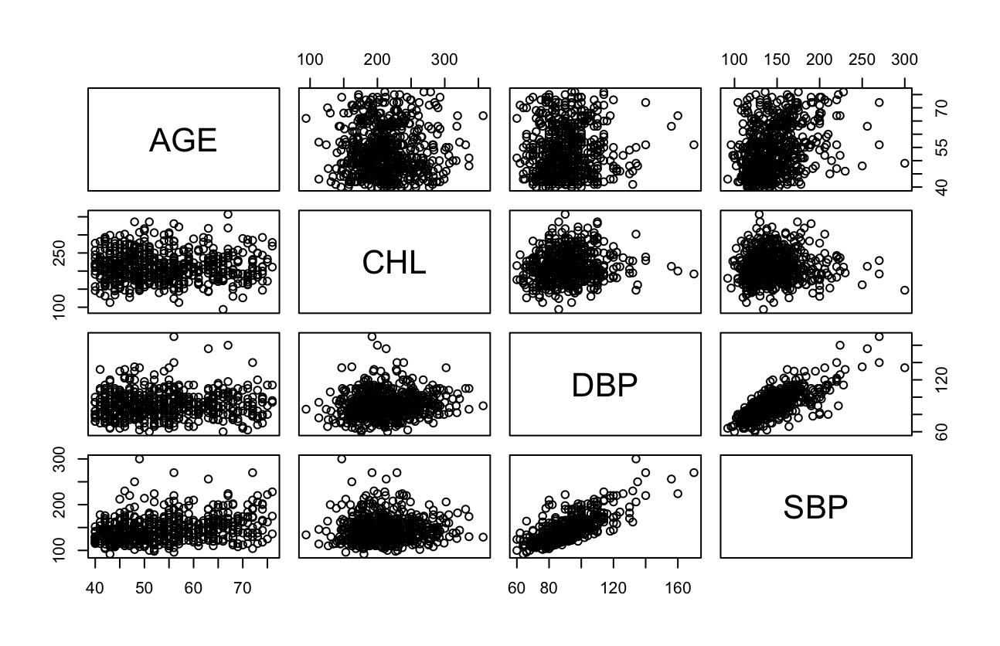

Here we see that there is a linear relationship between DBP (Diastolic) and SBP (Systolic). Nothing here is groundbreaking though, we therefore need to keep looking.

Why is this useful?
: Using this function you will receive multiple scatter plots attempting to **represent possible "pairwise" correlation between two variables**: you can ***observe possible correlations between variables***, if not, you can just observe the *distribution of the data points of each variable* on their own.

### Generating histograms

Imagine a histogram as a bar chart, of which bars are canonically termed as "**bins**". The purpose of a histogram is to represent the distribution of a dataset, this is useful as you can:

* Observe whether the distribution of a dataset is **normal** (**Gaussian**) or not.
* You can observe **bin outliers**, or peaks, in the distribution, which could be intriguing in the analysis.

To create a histogram:
```R
hist(plot_title[x_axis_values, y_axis_values])
``` 

Or more specifically for TD2:
```R
for(i in c("AGE", "CHL", "SBP", "DBP")) {
  hist(Evans[, i])
}
```
#### Output:
*AGE*: Skew right
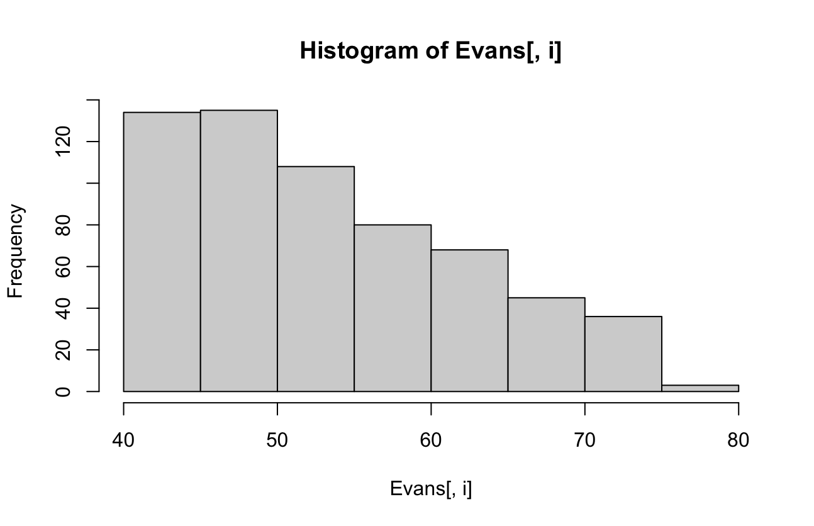
*CHL*: Nearly Unimodal
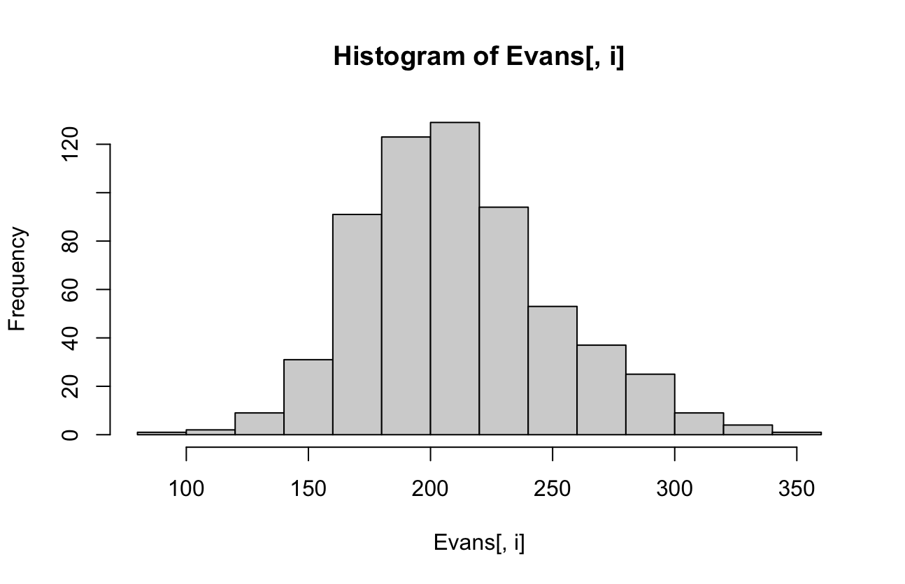
*SBP*: Skew right
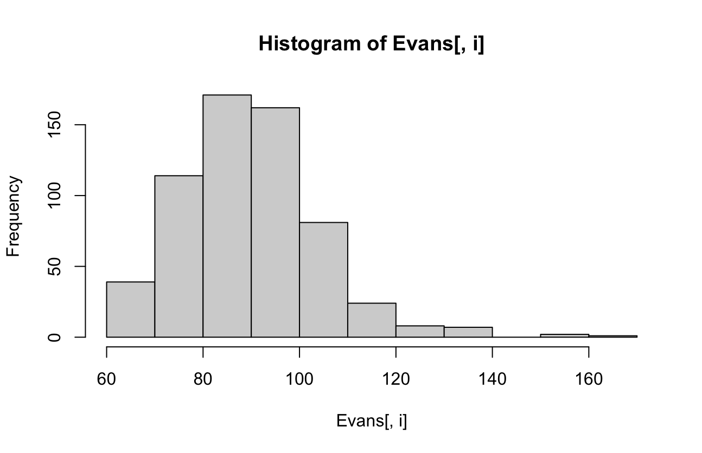
*DBP*: Skew right
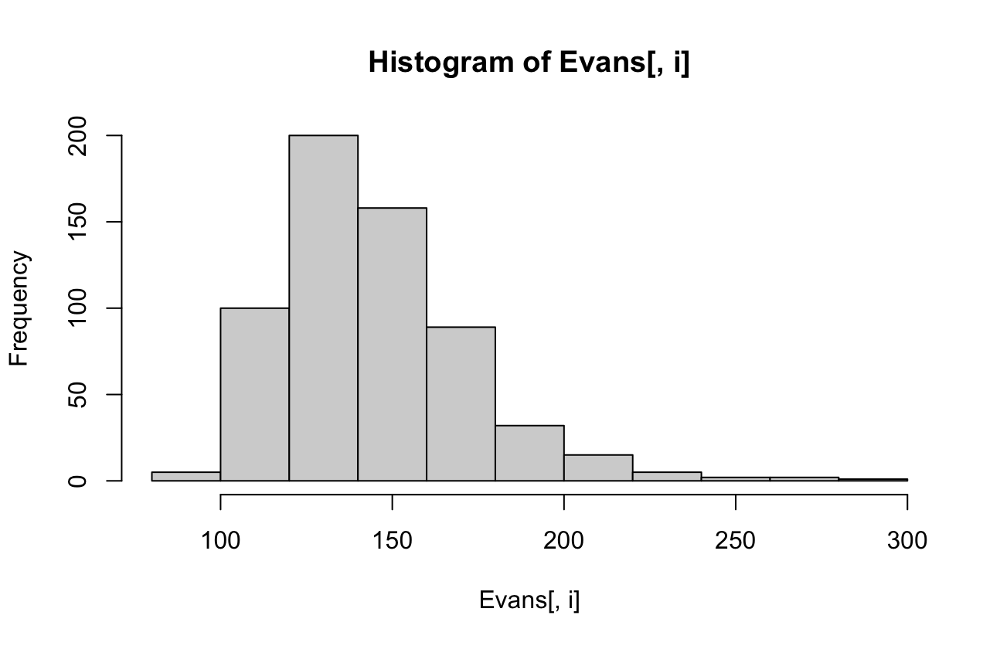

From the resulting graphs, use this rubric to characterise the distribution of each variable correctly:


### Generating boxplots

Boxplots are useful to determine distribution of data between different variables, therefore you would use boxplots to determine variable spread, statistical calculation of the spread for each box and possible relationships in the spread of data.

Here we are creating boxplots to visualise the spread of each variable in the list, compared to CDH data:
```R
for(i in c("AGE", "CHL", "SBP", "DBP")) {
  boxplot(Evans[, i],Evans$CDH, data = Evans)
}
```
#### Output:
*AGE*:
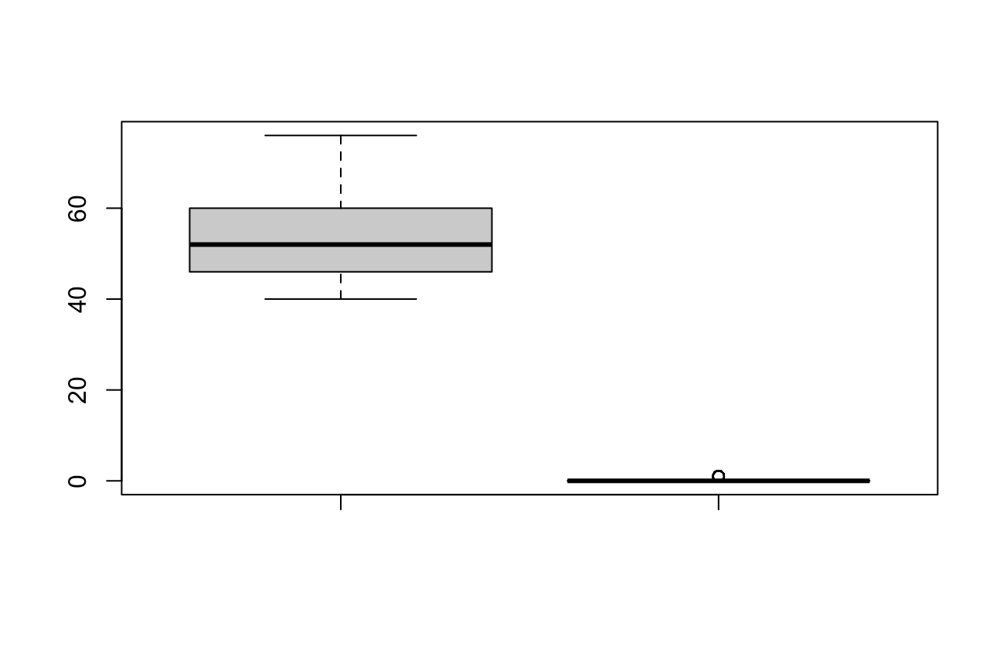
*CHL*:
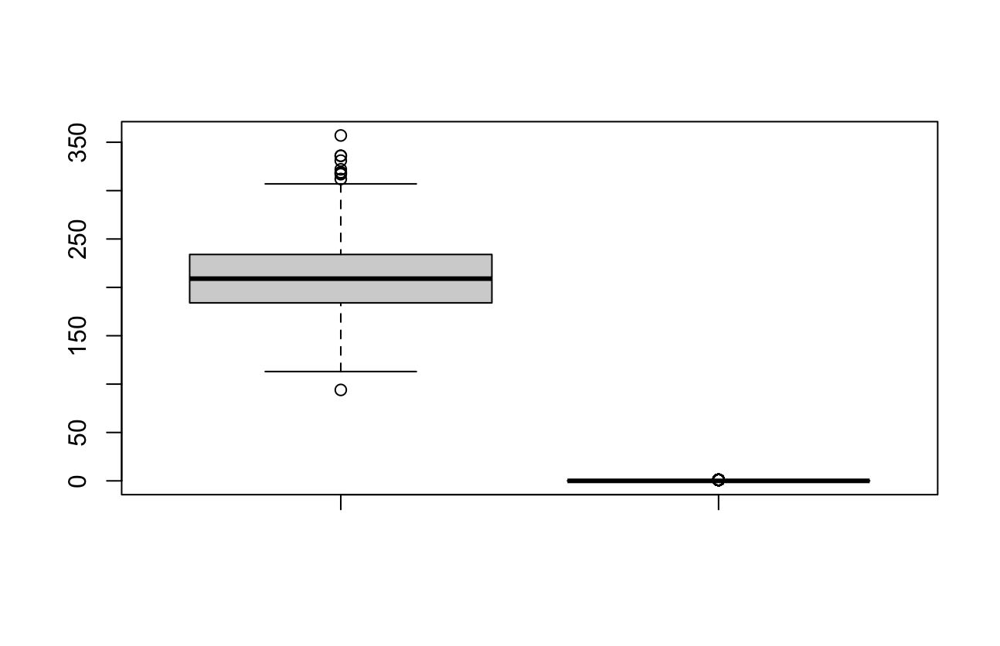
*SBP*:
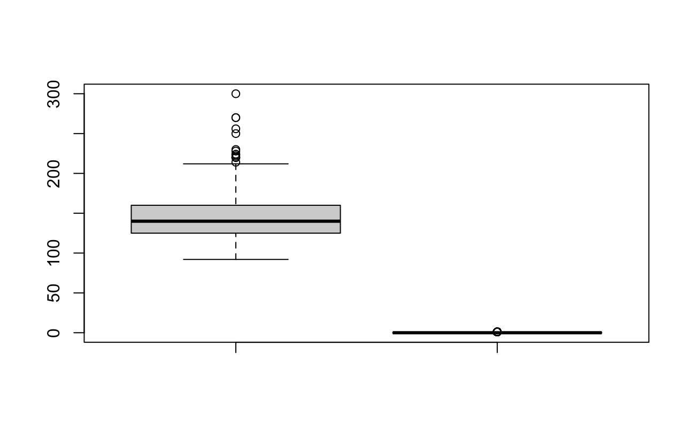
*DBP*:
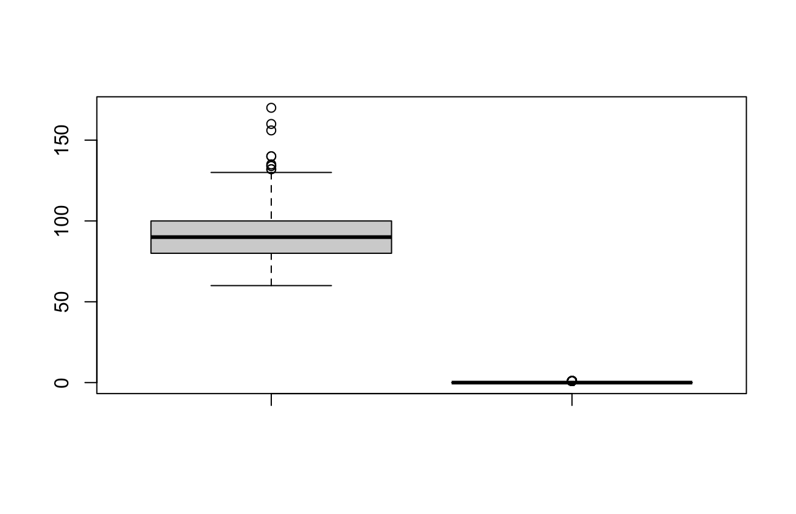

### Generating contigency tables

Contigency table
: A type of table in matrix format, which displays multivariate frequency distribution in the provided variables. 

With regard to TD2, we can **directly compare the data** available for each of our binary variables against CDH (Coronary Heart Disease); looking at the **effect of these contributing factors, to CDH**:
```R
for(i in c("CAT", "SMK", "ECG", "HPT")) {
  print(table(Evans[,"CDH"],Evans[, i]))
}
```
#### Output:
```R
      0   1
  0 443  95
  1  44  27
   
      0   1
  0 205 333
  1  17  54
   
      0   1
  0 401 137
  1  42  29
   
      0   1
  0 326 212
  1  28  43
```
We can also place the above information into **stacked** **barplots**, looking at the distribution of CDH compared to our list of variables:
```R
for(i in c("CAT", "SMK", "ECG", "HPT")) {
  barplot(table(Evans[, i], Evans$CDH))
}
```
#### Output:
In the following "easy to make barplots" at **position 0 of the x-axis** we observe the **proportion of i** (index in list) which **has CD (==1~Gray==)**, or **doesnt have (==0~Dark gray==)** CDH. 

Whereas at **1 on the x-axis**, we get a stacked bar representing the number of 1s and 0s for CDH as a whole.

*CAT*:
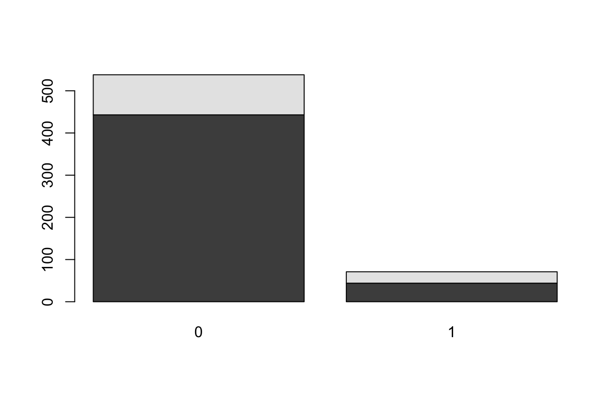
*SMK*:
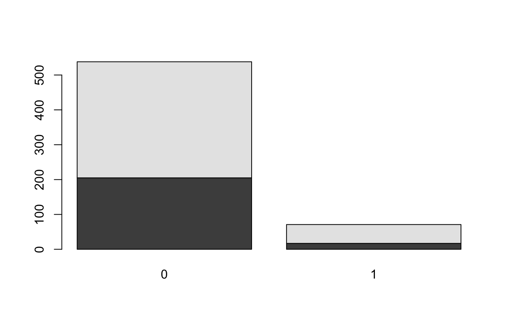
Here we observe the highest ***proportional correlation*** between **smoking** and **coronary heart disease**.
*ECG*:
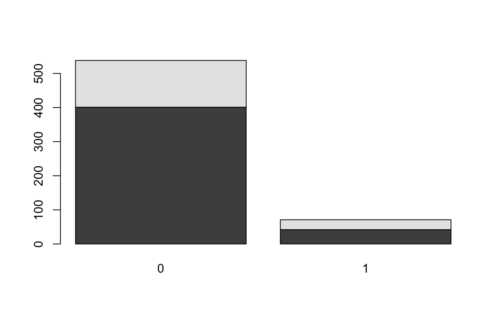
*HPT*:
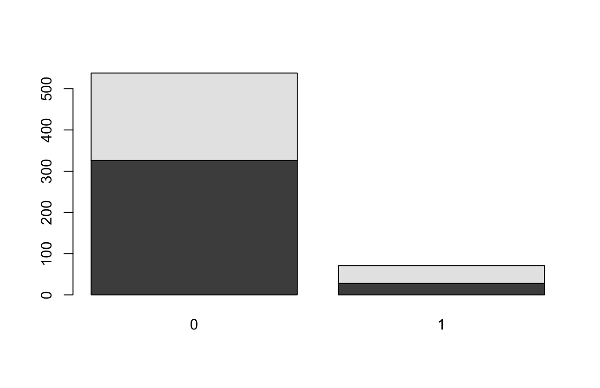

### Chi squared test

Upon suspicion of c*orrelation between dependent and independent variables*, even to test that the proportions seen between dependent variables are **not random**, one would use a chi squared test.

Given the example of the Evans dataset, we have already observed a possible correlation between CDH and smoking (SMK); what we want to do is now disprove the null hypothesis (no correlation; random chance) and accept the possibility of correlation between CDH and SMK.

Particularly, this test relates to goodness of fit-testing, where fit can be the **model** we have created between two variables.

```R
#Fit the model Evans to test the association between the data in the columns CDH and SMK
chisq <- chisq.test(Evans$CDH, Evans$SMK, correct = FALSE)

print(chisq)
```
#### Output:
```R
Pearson's Chi-squared test

data:  Evans$CDH and Evans$SMK
X-squared = 5.4293, df = 1, p-value = 0.0198
```
We obtain the X-squared, but above all, the **p-value for false positive discovery**. In our case, the **p-value is significantly low**, therefore a ***possibly causal relationship***.

Note: The null hypothesis can differ depending on the analysis we are conducting.

### Generalised Linear Model: No Gaussian Distribution.

Probability density functions are used to compute the probability by which a pre-existing distribution of our dataset could occur in a larger population etc. In other words, the ***probability density functions give us our p-values***.

In a **poisson** distribution, where the distribution is not normal, or **not Guassian**, even if the means between a normal distribtion and poissson distribution are the **same**, a **specific** method of analysis is required to **avoid error**.

==**Generalised linear models**== are particularly important when trying to calculate correlation probability (*"depndent distribution probability"*) for datasets which involve **binary variables**: 

Take for example the Evans dataset, which plots Coronary Heart Disease (CHD) amongst a range of contributing factors, **including smoking status**, which is ***another binary variable***. 

In these instances, you **will not**, **OBVIOUSLY**, have a normal distribution; you will instead encounter a **Poissson** distribution:

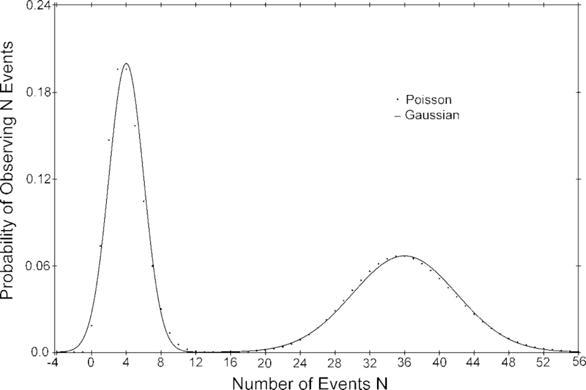

Or, other examples include variables which can only assume **specific values**; 

Ex. How much do I want to shit myself:

```
- 25%
- 50%
- 75%
- 100%
```
The "Shit priority graph" will **not** be normally distributed as there is very **constrained variability** in the data.

Poisson distribution
: Categorical variables which can assume different states in a ***non-binary fashion***; variables with **discrete** values to convey different states of the categorical value.

#### Using GLM in TD2:
We have already seen that there is a possible **causal relationship** between smoking and CDH.

To further explore this, we create a ***generalised linear model*** to observe the possibility for this **relationship existing in larger populations**; 

Since the distribution is **not Guassian**, as our variables **respond to "yes" or "no"** (==**binomial distribution**==), we have to ***adjust the "family" parameter accordingly***:
```R
glm <- glm(CDH ~ SMK, data = Evans, family = binomial)

summary(glm)
```
#### Output:
```R
Call:
glm(formula = CDH ~ SMK, family = binomial, data = Evans)

Coefficients:
            Estimate Std. Error z value Pr(>|z|)    
(Intercept)  -2.4898     0.2524  -9.865   <2e-16 ***
SMK           0.6706     0.2919   2.297   0.0216 *  
---
Signif. codes:  0 ‘***’ 0.001 ‘**’ 0.01 ‘*’ 0.05 ‘.’ 0.1 ‘ ’ 1

(Dispersion parameter for binomial family taken to be 1)

    Null deviance: 438.56  on 608  degrees of freedom
Residual deviance: 432.81  on 607  degrees of freedom
AIC: 436.81

Number of Fisher Scoring iterations: 5
```
#### Dissecting the output message:
- ==**Intercept**==: simple maths, its the **predicted outcome** of our **dependent variable**, ***==IF== the independent variable is 0***. 
  - In other words, it demonstrates *what the dependent variable will look like* if the independent has **no effect** on it.
  - If the estimate is **negative**, 
- ==**z-value**==: the ==Wald statistic==, where **z demonstrates the deviation of a values from the dataset's mean**. 
  - If the **z-value is 0**, there is **no deviation** of the value **from the mean** and as such no variance.
  - **Positive or negative values** are if the value is **deviating higher or lower than the mean**, ***respectively***.
```R
#Deviance the likelihood ratio between the model and the model without any predictors

oddsratio <- exp(coef(glm)[2])
print(oddsratio)
#Smokers have a relative risk of coronary disease thats twice more important than from people who don't smoke.

twoby <- twoby2(Evans$CDH, Evans$SMK)

# CDH and HPT

chisq2 <- chisq.test(Evans$CDH, Evans$HPT, correct = FALSE)

glm2 <- glm(CDH ~ HPT, data = Evans, family = binomial)

oddsratio2 <- exp(coef(glm2))

twoby02 <- twoby2(Evans$CDH, Evans$HPT)

#CDH and HPT, taking into account SMK

glm9 <- glm(CDH ~ HPT + SMK, data = Evans, family = binomial)

summary(glm9)
anova(glm9, glm)

# CDH and AGE as a continuous variable

chisq3 <- chisq.test(Evans$CDH, Evans$AGE, correct = FALSE)

glm3 <- glm(CDH ~ AGE, data = Evans, family = binomial)
summary(glm3)

oddsratio3 <- exp(coef(glm3))

twoby03 <- twoby2(Evans$CDH, Evans$AGE)

# CDH and AGE as a categorical variable

#Can use break or cut function to create the categories

#Let use binary variables to understand if we are in the category (except for the reference)
# x {1 if  (49,59]
#    0 otherwise}
# x {1 if  (59,69]
#    0 otherwise}
# x {1 if  (69,79]
#    0 otherwise}

AGE2 <- cut(Evans$AGE, seq(39,79,10))


chisq4 <- chisq.test(Evans$CDH, AGE2, correct = FALSE)

glm4 <- glm(CDH ~ AGE2, data = Evans, family = binomial)
summary(glm4)

oddsratio4 <- exp(coef(glm4))


twoby04 <- twoby2(Evans$CDH, AGE2)

# CDH, SMK, HPT and AGE

chisq5 <- chisq.test(Evans$CDH, Evans$SMK, Evans$HPT, cut(Evans$AGE, breaks = c(0, 40, 60, 80, 100)), correct = FALSE)

glm5 <- glm(CDH ~ SMK + HPT + AGE2, data = Evans, family = binomial)
anova(glm4, glm9, glm5)

oddsratio5 <- exp(coef(glm5))
#twoby05 <- twoby2(Evans$CDH, Evans$SMK, Evans$HPT, cut(Evans$AGE, breaks = c(0, 40, 60, 80, 100)))

# Perform a variable selection using the step function stepAIC from the MASS package

stepAIC(glm5, direction = "both")
```R