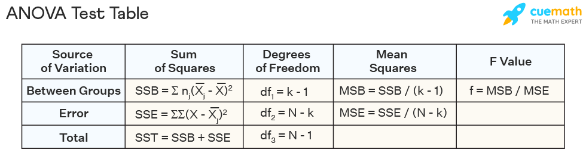

# An introduction to stats

## Linear Regression: A linear model.

**Simple Linear Regression**, or a **Multiple Linear Regression**:

### Example:

#### Simple Linear Regression

Does *height* influence the **weight** of a person?

* One independent variable and one dependent.

#### Multiple Linear Regression

Do *height* and *gender* influence the **weight** of a person?

* **two independent** variables and one dependent.

Key:
**Dependent** variable
*Independent* variables

## Simple Linear Regression (SLR): Formula and theory.

The aim of this statistical prediction model is to identify a relationship between **two** sets of data; 

This would graphically be represented with a linear equation:

### $y = b * x + a$

*Where*:

$y$ is the **dependent/expected** variable
$b$ the **slope**
$x$ the **independent** 
$α$ the **y-intercept**

Alpha and Beta are termed **regression coefficients**, the unknown values which **influence** the predictor values.

When we have what appears to be a linear relationship, in order to properly classify it, we must attempt to locate the best possible fit/line between all points. The **distance** between the predicted line and the data points which are correlated, is called the **residual**, the **ERROR**, represented by **epsilon**; $ϵ$.

### SLR formula: $Y=f(X,β)+ϵ$
Where:

Y is the response, or **dependent** variable;
$f$ is some mathematical function;
X is a matrix of predictor (**independent**) variables;
$β$ are the model parameters;
$ϵ$ is the random error term ==(in modelling: a **residual**)==.

You would use this statistical model to characterise a **linear relationship** between given sets of values.

When calculating the line of best fit, you want to discover the value of the coefficients, alpha and beta, using the **Ordinary Least Squares** method. 

## Multivariate regression (MLR): Formula and theory.

Not to be confused with multiple regression, you now have **multiple** dependent variables (aka, criteria) instead of one:

* Here, you have the culmination of x mount of regression models, to reach a conclusion on x amount of criteria.

Therefore, you would have the following transformation of the formula:
### $ SLR = y = b * x + a$
==>
### $ MLR = y = b_1 * x_1 + b_2 * x_2 + ..... + b_9 * x_9 + a$ 

Where the SLR formula would be calculated once per independent variable ($y$), for a single dependent, you know have multiple instances of dependents ($ b * x $) calculated for the **influence** a ***single independent variable*** has on them. (There can be many independent variables still)

## Coefficient of determination and standard error: R^2^ and STDEV

R^2^ represents the **proportion of variance** wihtin a data set. Alongisde STDEV, it can help determine if the data is for one, **correlated** and by extension, represented through a liner relationship.

Say we have a dataset which contains hours studied, exam score and preparation exams taken.

Score is our dependent variable (criteria) and the independent variables are the hours and prep exams taken.
```R
df <- data.frame(hours=c(1, 2, 2, 4, 2, 1, 5, 4, 2, 4, 4, 3, 6, 5, 3),
                prep_exams=c(1, 3, 3, 5, 2, 2, 1, 1, 0, 3, 4, 3, 2, 4, 4),
                score=c(76, 78, 85, 88, 72, 69, 94, 94, 88, 92, 90, 75, 96, 90, 82))

# Or:

data <- load("path_to_data.RData") #Usually the information in these files should be in dataframe format.
df <- data

# If an RData file doesn't already format its data into dataframes:

df <- as.data.dataframe(data) 

#Now you need to create a linear model

model <- lm(score~prep_exams+hours, data = df)  

summary(model) #Or, if you only want to see the RSquared you can do the following: summary(model)$r.squared
```
### Using the lm (linear model) function:
```R
model <- lm(score~prep_exams+hours, data = df) 
```
Where: 
* The criteria (**dependent variable**) is placed before the **"~"**
* The predictors (**independent variables**) are placed after the **"~"**, if there are multiple, use a **"+"** to join them.
* data should be **assigned** to the **dataframe**.

## Assumptions for linear models

* Linearity: There must be a linear relationship between the dependent and independent variables.
* Homoscedasticity: The residuals must have a constant variance.
* Normality: Normally distributed error.
* No multicollinearity: No high correlation between independent variables; where it is too difficult which independent variable is affecting the dependent the most.

## Obtain OLS estimators; model parameter, the β~x~ (β-hat).

To obtain 
\[
\hat{\boldsymbol{\beta}} = \left( \mathbf{X}^\text{T} \mathbf{X} \right)^{-1} \mathbf{X}^\text{T} \mathbf{y}
\]

In a way you could say, this is the method by which you can identify the **slopes** of your **dependent variables**; your **criteria**.

To reproduce this in R:
```R
X <- #Your dependent variable here
y <- #Your independet variable here
ur_hat_beta <- solve(t(X)%*%X)%*%t(X)%*%y
```
## T-test
The t-value is either produced by calling **summary()** on your model, or can be done manually;

In the following function, you can perform a **one sample** t-test.
```R
t.test(your_variable, mu = X)
```
Where your_variable relates to either an independent or dependent variable and **mu** the *hypothesised mean for your population*; a metric for analysing the null hypothesis.

For **multiple sample** t-tests, replace parts of code as required:
```R
t.test(dependent_variable ~ independent_variable, data = ur_dataframe)
```
## ANOVA



A set of calculations pertaining to multiple intertwined statistical tests for data significance. The above table is an example of **one-way ANOVA**; for ***analysis of variance***.

As posited in class, a method of ***testing significance through model comparison***;

In R, this translates to:
```R

model_for_ANOVA <- lm(variable_x ~ 1, data = ur_dataframe)
your_model <- lm(variable_x ~ variable_y, data = ur_dataframe)

anova(model_for_ANOVA, your_model)
```
To obtain the **residuals**, the error, by means of your model comparison:

```R
variable_xy <- 3.4
predict(your_model, data.frame(variable_x =variable_xy))
```


