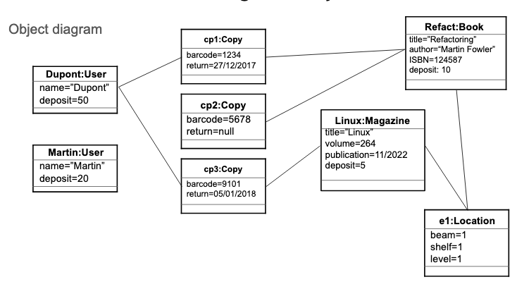

## Object Diagram to convert into Python



## Classes in Python

Introduce class: 

`class name_here:`  

Under class, indent and initialise: 

```python
def __init__(self, attribute, attribute):
```

**self** allows Python to access within the boundaries of the class.  

Having initialised the class, follow up by **indenting** and introducing class **attributes**, for instance:

`self.title = title`
`self.author = author`
`self.isbn = isbn`

These attributes and their assigned values are **only** accessible within the same instance; so within the confines of `def _init_`.

Whereas, you could add:
```python
class Chat:
Cleio = "MeowCat"
def _init_(self, meow)
    self.Cleio = meow
```
For any code **outside** of the instance `def _init_`, _Cleio is equal to a MeowCat_, however **within** the instance, _Cleio is equal to whichever value **meow** obtains_; if **meow** obtains no value, Cleio remains a MeowCat.

Also, the above example assigns the attributes to the information that will be obtained by `def _init_(self, title, author)`; 

Title is obtained by a **method** which does its calculations then returns the title:

```python
def get_title(self):
    do_something
    return self.title
```
In this example, the **method/function** get_title can return "Miauler". "Miauler" will then be assigned to `self.title`

## Good practice in Python OOP

While it is feasible to have all necessary classes within the same Python file, it is often preferred to split your **packages**(=Classes, their attributes and methods) into **inteconnected Python files**

