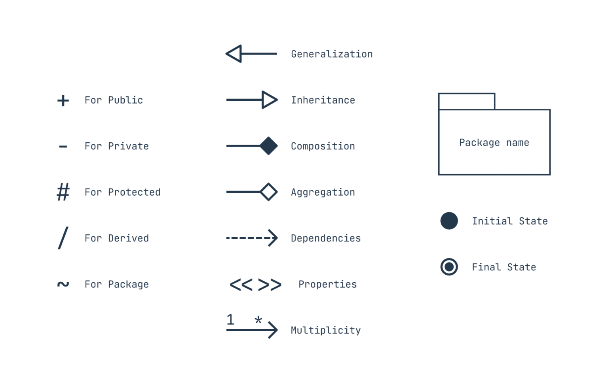
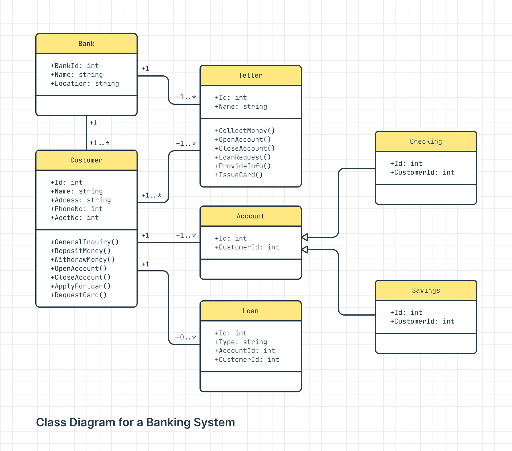

## Learning UML: Basics

UML enables code developers to structure the programs they intend to develop in an easily readable diagram.

In object oriened programming, UML is required to not only demonstrate the different classes that will exist within the nascent program, 
but also the attributes and the methods that will manipulate these attributes within a class.

Classes and their accompanying items are positioned in boxes, with the first row reserved for classes, the second for attributes (**class descriptors**) and the third for methods. 

Say **Phone (Remember to capitalise) is a Class**; CPU, CAMERA and SSD are its attributes and **picture() is a method**. (_first letter of methods not capitalised, if more than one word, capitalise the first letter of each following word_)

One must explain what type of data can be stored within the aforementioned attributes; this could be CPU: Float / CAMERA: String / SSD: Integer.

When the Picture() method is used, CPU, CAMERA and SSD could interact, as in a real phone, and therefore Picture() could adopt a storage system of a dictionary; so picture(): Dict

One should also denote if an attribute or a method should interact with those of other classes, or should be restricted within its own class. One way to do this is the following:

"**– = Private**, _meaning no accesses from other classes_"
"**+ = Public**, _accessible to other classes_"
"**# = Protected**, _accessible by the same class or subclasses_"
"**~ = Package**, _can be used by any class in the same package_"

These can also be used for **methods**.

## Relationships in UML

### Inheritance
**Inheritance** or otherwise known as **Generalisation** is when classes interact with each other, to "trade" information. Key terms:

**Superclass** : _A class from which other classes inherit code/data_
**Subclass** : _A class which inherits code/data_

Using the previous example of the **P**hone class, if we were to make _SSD_ a _superclass_ and a change were to occur in class _SSD_, _CPU and CAMERA_ will **inherit** the change.

To describe this reltionship of **inheritance**, the subclasses will be joined to the superclass with **hollow arrows**. 

### Association

What happens when classes are related to each other, as in, they can **share** code/data but are not **dependent on each other**?

In this case you join the classes using **straight lines**. 

**REMEMBER** you are not restricted to joining just the large class boxes together. In regards to association, the same rules can apply when demonstrating the association **between methods or attributes**.

### Aggregation

Say we want to convert a football team into a combination of classes. 

If we were to arrange class _Team_ and class _Player_ as two dist(inct)ant classes, we could have: 

Team (Class) / +name: str, +city: str, +division: str / +gamesPlayed(), +hireCoach() 

Player (Class) / +name: str, +position: str, +amongusscore: int / +gamesPlayed(), +hoursTrained() 

While a team can have specific players, players aren't all in the same team, or could be **free agents**, therefore, class Player can be **associated** with Team and can be a **part of team**, but can also **stand on its own**.

**Aggregation** therefore concerns the relationship between associated classes, which are not dependent, can be **parts of other classes** and can **exist on their own**. 

**To show aggregation**, link classes with a straight line but replace the hollow arrow with 

A **hollow rhombus** joined at the "independent" class, aka Player.

### Composition

If a **subclass** _cannot exist without_ its **superclass**, this relationship is shown with:

A **straight line and a diamond** (not hollow) joined to the superclass.

### Dependency 

If classes are dependent to each other, where on class **relies** on the calculations/data of another class, the relationship is shown using:

A **dotted line with an open arrow**, pointing to the class that produces the _required_ data:

Let's say that class Coach relies on the performance data of class Player. A dotted line with an open arrow points to class Player.

### Multiplicity

If we were to use a football team as an example again, there can only be **one** team to which **multiple** players can be assigned to.

In UML, to demonstrate numerical relationships between classes, or even attributes, use the following notations: 

- **0..1**: zero to one
- **1**: exactly one
- **0..***: zero to many
- **1..***: one to many
- **n..m**: specific number range

Remember, 0..1 can be elusive, use it if a class can either not exist in some cases, or there can only be one instance of it.

## Summary of UML

## Class diagram example

