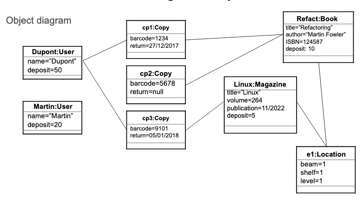

## Object Diagram to convert into Python



### Creating Classes in Python

Introduce class: 

`class name_here:`  

Under class, indent and initialise: 

```python
def __init__(self, attribute, attribute):
```

**self** allows Python to access within the boundaries of the class.  

Having initialised the class, follow up by **indenting** and introducing your class **attributes**, for instance:

`self.title = title`
`self.author = author`
`self.isbn = isbn`

**REMEMBER** to add the `self.` when assigning your attributes. 

Also, the above example assigns the attributes to the information that will be obtained by `def _init_(self, title, author)`; 

Title is obtained by a **method** which does its calculations then returns the title:

```python
def get_title(self):
    do_something
    return self.title
```
In this example, the **method/function** get_title can return "Miauler". "Miauler" will then be assigned to `self.title`

