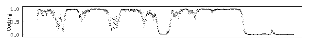
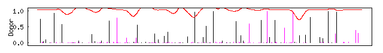

# Structural and functional annotation of genomes

In fucntional genomics two questions have to be answered:

1. Where are the genes within the genome and how are they distributed?
=> Structual Annotation
2. What fucntion do these genes have, does this relate to their position?
=> Functional Annotation

## Identifying genetic signals within sequences

1. Find the **introns** and the **exons**; for *introns*, you would ***analyse for low GC content*** and for *exons* look for areas with a ***high GC content***.
2. Find **Transcription Start Site** (TSS).
3. In **non-plant** sequences, the **TATA box**, the **motif**, the **GC box**.
4. Look for **start and stop** codons.

## Predicting genetic function

A tool proposed in class is **NetGene2**, found at: https://services.healthtech.dtu.dk/services/NetGene2-2.42/ 

* One metric to choose from are the **donor graphs**; donor sites, the **black lines**, correspond to the **start of an intronic sequence**.

* The **acceptor graph**, with its acceptor sites, correspond to the **ends of intronic sequences**. 

Overlap this information with the **GC content** graph and you can see a pattern of intron and exon sequences.

### Analysing a GC content graph.

 

The **drops** in the above graph correspond to **introns**, while the **exons** are the **peaks**.

### Analysing the donor and acceptor graphs

#### Donor graph:

Per documentation of NetGene2
:  In the "Donor" panel the activity of the ensemble of the donor site predicting networks is shown as impulses. An impulse with a height close to 1.0 indicates a strong A. thaliana donor site. ***A cyan impulse is a prediction that has been discarded*** during the refinement, and a **magenta colored impulse** is a ***prediction that has been changed by the rule based system***.

## Detecting intron splice sites

In the majority of cases **"GT" and "AG"** are the ***start and end of introns, respectively***. 

Specifically, adapted agorithms look for ==***CAG|GT and AG|G for start and end respectively***==.

