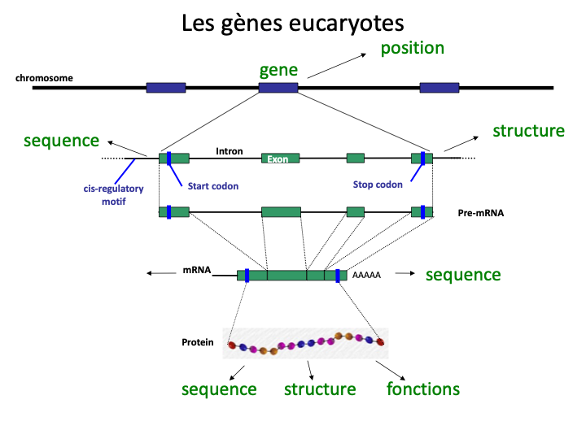
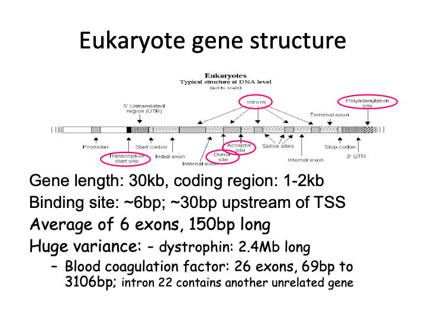
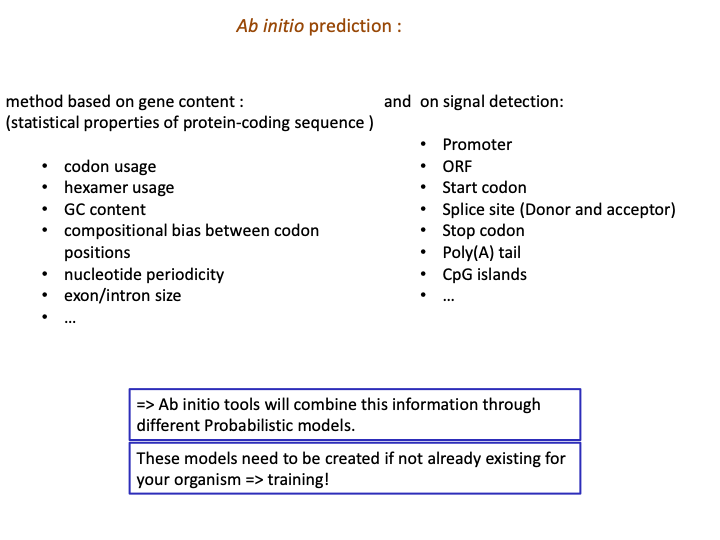

## ORF in eukaryotes: The eukaryotic gene structure

Remember
: ***Majority of exons*** in eukaryotic genes are small; at ***~150bp***. Major takeway, it is difficult to annotate a eukaryotic genome due to the nature of the exons and the number of introns.

## Approaches in eukaryotic gene identification

Ab initio prediction : 
    These methods detect the signals on the sequences
Similarity-based methods :	
    These use similarity to annotated sequences like proteins, cDNAs, or RNAseq
Hybrid approaches : 
    Ab initio tools with the ability to integrate external evidence/hints 
Comparative (homology) based gene finders : 
    These align genomic sequences from different species and use the alignments to 	guide the gene predictions
Chooser, combiner approaches : 
    These combine gene predictions of other gene finders 
Pipelines : 
    These combine multiple approaches

## Ab initio prediction methods: As in, *de novo*

*To teach a model to predict gene presence within a set of genetic code, the system must be trained on previously annotated genetic sequences; in order for there to be a "mean" or "median" to compare against to.*

- In fact, around 1000 annotated (known) genes might be needed to train a model with the method mentioned before.
- Prefer high quality genes as of course the training data will reflect onto the quality of the model.

* The following image depicts the so called "quality" that's needed in the known genes, to train the model we want.

