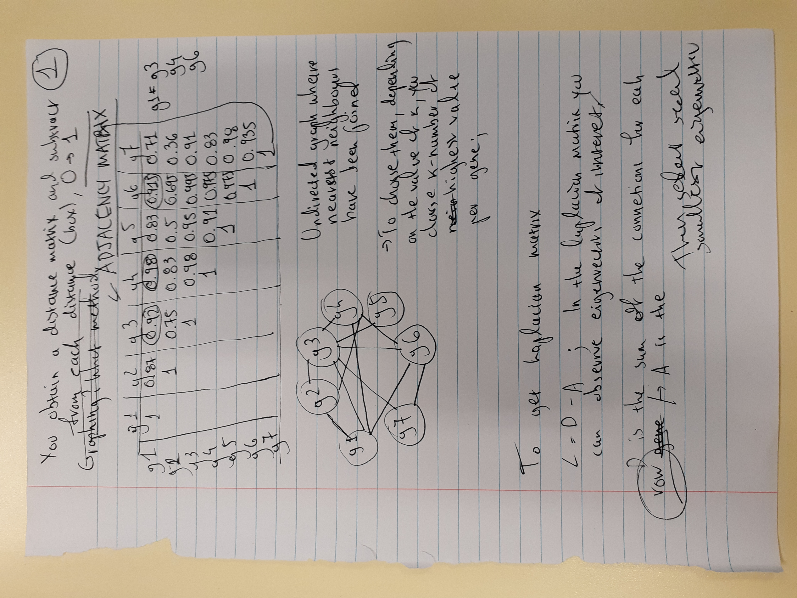

# Spectral Clustering

* **Convex cluster**: Basically, in a convex cluster, you can **draw a straight line from any point in the cluster to any other point in the cluster without leaving the cluster**. For example, a U-shaped cluster would not be convex because you could not draw a straight line from one end of the U to the other without leaving the cluster and crossing across empty space.    

## Eigenvalues and(/or) eigenvectors: Additional theory.

Eigenvectors are the vectors which following a linear transformation of the points within a matrix, **eigenvalues** shall remain the same;

Given the picture of a vector space which you could equate to the fabric of time in space, a **linear transformation** would would change vector positions in an "**equal distribution**" of sorts. 

If we were to represent vectors within this vector space as points on a graph, which are connected to their x and y intercepts with a line, during a linear transformation **all of these lines** should remain parallel.

Or in other words, in a linear transformation, when calculating the distances between vectors, **distance should remain the same before transformation occured**. 

**Eigenvectors** are those which despite a linear transformation **do not** "change their position" following transformation, like anchor points in the "fabric of time".

## Degree, Adjacency and Laplacian Matrices

### Degreee Matrix
A **Degree** Matrix is an integral part of graph theory, and is a matrix based representation of an undirectional graph; 

Specifically, a Degree matrix has the **number of connections** of **each point** in ***succesive order***, on the ==**diagonal**== of the matrix. (See Wikipedia screenshot)
### Adjacency Matrix

To start with, we are not required to learn how to compute weights to generate an Adjacency matrix; it's either given to us, or we **assume** that the **weight is 1 and non zero**.

If you do however need to calculate the weights of connections between points, you would need to generate a **similarity graph** (an undirected graph).

In order to do this, you will obtain a **euclidean** distance matrix [d(a,b)], or possibly calculate one, which will then be modified by **subtracting the value of each euclidean distance, from 1**:

$Weight <=> Similarity $
$ => 1 - d(a, b)$

- With the **similarity graph and matrix** at hand, you can now generate an Adjacency Matrix:

The easiest method to generate an Adjacency Matrix is with the assumption that all connections ("boxes") have the same weight, and therefore you:

**Subtract 1 from each box in the distance matrix**.

- ==Otherwise==, if you have the weight/similarities calculated, you will then ***subtract those from the distance matrix*** to obtain the Adjacency matrix.

### Laplacian Matrix

If you were to visually imagine how to generate a Laplacian matrix, think of placing an Adjacency matrix, ontop of a Degree Matrix;

- Such that the **Degree Matrix diagonal is retained**, and the **adjacency values are applied "negatively"**.

See Wikipedia Page.

The **mathematical** explanation of it, is:

$L=D-A$

Where for **each box** in the Laplacian matrix:

- $D$: is the Degree Matrix value at the exact same coordinates.
- $A$: is the Adjacency Matrix value at those same coordinates.

### Eigenvalues and Eigenvectors

Given a table of these magically calculated values, from the Laplacian Matrix:

Apply **k-means** to **cluster the eigenvectors** and obtain **two groups** through ==bi-partioning==.

That is, with the provided eigevectors, apply k-means to cluster the eigen vectors and ***achieve a two group partition***.

To perform this clustering you would need to calculate a **scaled adjacency matrix**, with the following formula:

$L = D*(-1/2) - A*(-1/2)$

Eigenvalues are on the left, you could also bi-partion by splitting at a specific interval.

# Spectral Clustering in practice

1. Begin by generating a **similarity graph** as explained previously, we will need this to then calculate an adjacency matrix.
    - To generate the connections in the graph:
        - ==***K-Nearest Neighbours graph***==: Where connections are drawn for **k-number** of **highest**/**closest** points in the dataset (for each data point).
        - ==***ε-graph***==: A ***threshold*** is introduced for the distance that can exist between two points. Ex. cutoff at 0.5. ***Limitation***: **Dimensionality of data**.

2. With a Degree Matrix and Adjacency Matrix you can now calculate a Laplacian Matrix; use the aformentioned formula.

3. Bi-partion (in our case) the resulting eigenvectors. 

