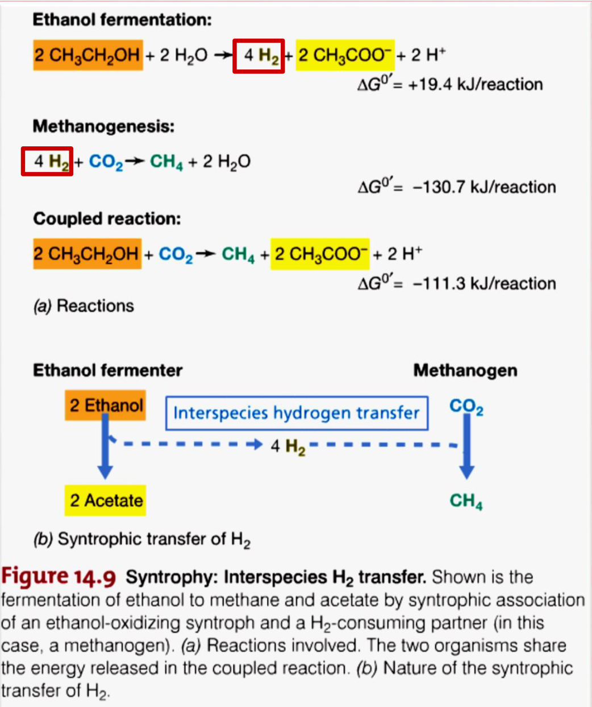
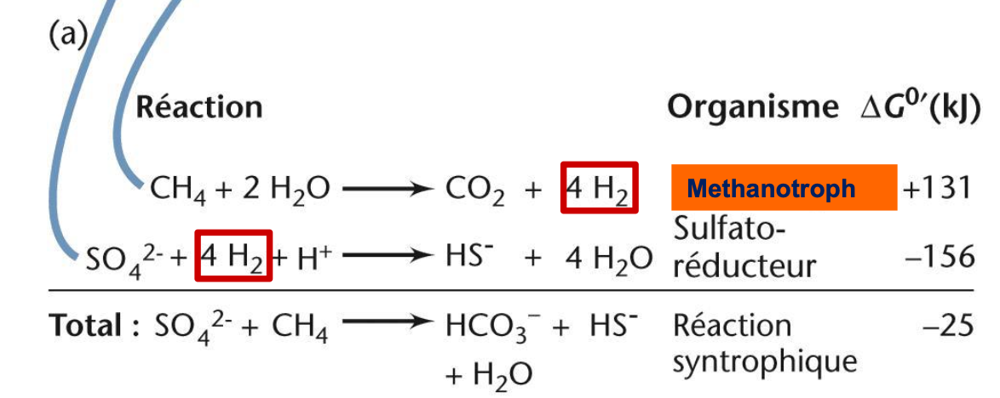
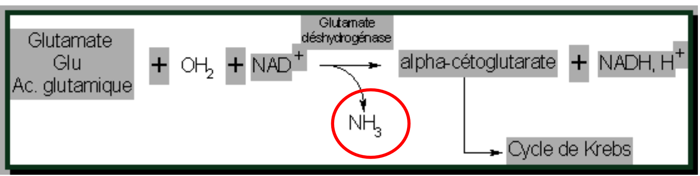
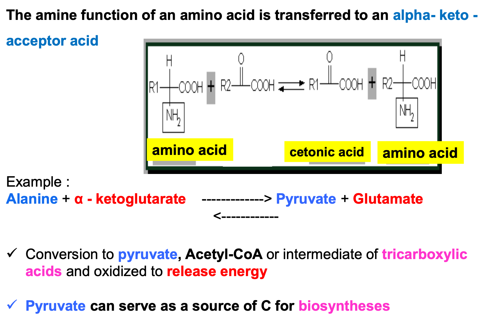
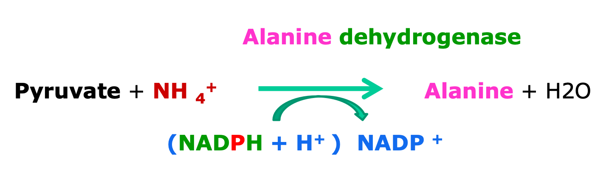
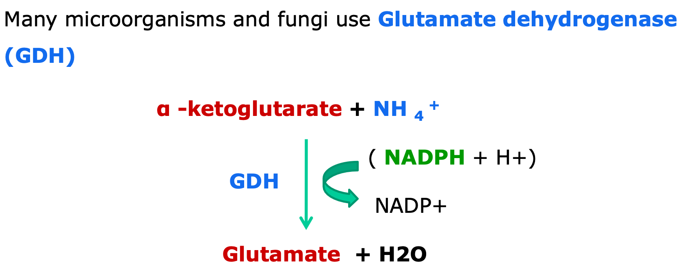

# Phylogeny and diversity of microbial metabolism

## General terms
Remember to mention in an exam about the differences between a light microscope and an electron microscope, which organisms they can magnify: 

- Maximum magnification/minimum size of detection for **light microscopes** is 0.2 micrometre.
- Maximum magnification/minimum size of detection for **electron microscopes** is 100000x stronger than light...

## Viruses
Viruses, which are non-cellular organisms (considered not alive; no metabolism, waste, respiration etc...) are the most important component of the microbial world.
- Remember that its DNA or RNA molecule (depending on the class), is contained within a **protein capsule**; a ==**capsid**==.

Professor termed viruses as **==intracellular== parasites**, both for eukaryotes and prokaryotes.

Bacteriophages are the **most important** virus as presented by the professor and are therefore ***25x*** more **prevalent** in the microbial world, than the rest.

## Prokaryotes and additional information
Dont forget to go over cellular structures for prokaryotes (*dont forget the importance of cellular walls*; **peptidoglycan**, **Gram-positive or Gram-negative** are affected differently) or eukaryotes in an exam:

**Nucleoid** in prokaryotes contain the DNA; dont forget to mention plasmids (antiobiotic-**resistance**/**linear** plasmids=bold-important).

Cellular wall protects, with its **NAG-NAM-tetrapeptide** structured peptidoglycan, against **osmotic pressure**.

- **Mircoplasm->Microbiome**

If asked about the terminology of **Pro**-karyote, dont be retarded. What separates eukaryotes and prokaryotes? **Organelles**, cell wall, flagella, etc.

Prokaryotes are split into: 
- **Bacteria** obviously.
- **Archaea** obviously.

**What differentiates them?** ==Metabolism== and ==Architecture==:

- ==Archaea **don't have** peptidoglycan== and their cellular membrane is composed of ==**glycerol** joined to **phytanols** through an **ether link**==. 

- Whereas bacteria have **ester-linked** **glycerol and ==fatty acids==** in their cellular membrane.

Because of these cellular structures, bacteria can **ONLY** survive up to 80C. 

Whereas for **Archaea** often assume the survivability of **extremophiles**; able to survive in ***highly alkaline, or acidic conditions, or even 121C***.

Remember that eukaryotes can mostly survive up to 62C, in comparison.

==Robert Whittacker== was the one who re-arranged the kingdoms for fungi, separating them from **protists** (unicellular) and creating a new kingdom for **filamentous** **multicellular** organisms such as Fungi.

- What was termed as **Monera** in the old classification, he designated them **Prokaryotes**.

## Microbiota

A microbiome has by extension, a **colective genome** *derived from its multiple components*:

To analyse a microbiota, one should "ask" some questions:

- What is there? What are the components? What are their differences and proportions?
- What are these components doing themselves or in conjunction with each other, what is their purpose? How do they transform their environment?

Think of the competition induced between the gut microbiome and newly introduced bacteria, otherwise the contribution of the microbiota to our nutriotional acquisition; metabolic processes which we cannot undertake ourselves and require the services of microbes in our gut, which can either digest our food to give us nutrients or even process toxic compounds.

## Antibiotic agents
- **Penicillin** and **Bacitracin** are ==cell wall== disolvers; *dissolving peptidoglycan*. 
- **Polymixin B**, **Cyclohexemide** aim to destroy the ==cell memrbnane==.
- **Chloranmphenicol** and **Streptomycin** target ==protein synthesis== (through bacterial uptake)
- **Rifampin**, ==inhibits RNA== within the nucleiod. 

## Bacterial structure

Remember the multiple forms in which bacteria can exist; in a **Rod** structure, a **Coccus** (ex. little grain of sand)--a **Diplococcus** is obvious and in **Spirill** formation (squiggly line).

## Fungal structure

You can have **unicellular** fungi, such as Saccharomyces.

You can also have, more common, **filamentous** fungi, formed of a large conga line of fungal cells/==conga line of **hyphae**==, therefore you observe *cell walls separating each cell within this conga line*.

- Remember the fungal cell wall is composed of **chitin**.

==Multinuclear filament fungi can be==:
- Ascomycetes
- Basidiomycetes
- Zygomycetes

Endosporilation
: Fungal ==**cysts**== can **interject** between the cells of the conga line, which contain **endospores** and are thereby essential in the *further proliferation/colonisation efforts of fungi*, through repeated **secretion** of these endospores from its **permanent** cyst.

Exosporilation
: Otherwise, you might observe the formation of **sporocysts** in fungi, which do not retain their spores within a cyst, but persist in secreting **exospores**.

- The **Mycete/Mycis** suffix, reffers to fungi and can serve as a descriptor for bacterial names; ==picturing the bacteria as filamentous, although unicellular==.

Actinomycetes therefore are the **conjugation of the mycete suffix** and the prefix **actino**; a **Gram-positive** bacterial species which looks like a starfish and have very **High GC content (>50%)**.

- Around 60% to 70% of antibiotics utilise the sporification of filamentous microorganisms.

On the contrary, Firmicutes the other phylogenetic group of **Gram-positive** bacteria, have **Low GC content (<50%)**.

## Cyanobacteria

Classified as algae in the past, are **Gram negative** bacteria which are **photosynthetic**; ergo the **cyano** prefix. 

## Diversity of anti-biotics

Specifically termed as **chemotherapeutic** agents, they operate either as **bacteriocides** or **bacteriostatics**. 

Diverse range of applications, **anti-septics** specifically target tissues exposed to the environment.

Why do antibiotic agents exist (aka ==**Secondary Metabolites**==)?

-> To **compete** with other microbes in the microbiota of the soil, for example, due to resource based competition; induced by **resource** constriction/**scarcity**.

## Use of microbes for production of non-antibiotics

==Vitamin B12, B2, C==: Mass produced by cultured fungi or bacteria, or both.

==Hormones such as Cortisol, Insulin, etc==: Bacteria/Fungi.

These methods are a lot cheaper in comparison to **synthetic methods**?????

## Agriculture

Enriched soils with beneficial bacteria or fungi, can enable us to avoid pesticides; biopesticides, which can secrete for example special toxins, which avert parasites and preserve the sanctity of the crops. (Bacillus thuringiensis)

Otherwise, you would observe bacteria which fix nitrogen from the atmosphere, and secrete it into the soil; a vital nutrient for plants. (N~2~ fixating bacteria....)

By absorbing N~2~, through the efforst of ==**Nitrogenase**== the **N~2~ will be converted to NH~3~ within the bacteria**, which can then be secreted to its surrounding environment and supplement the growth of plants; bacterial and plant **symbiosis**. 

**Lichens**
: Specifically, cyanobacteria, can perform both **nitrogen fixation** as explained above, as well as **photorespirate** (eat CO~2~), being the perfect **symbiotes** for many plant species.

Ground sterilisation
: Within a gram of soil you have ~10k microbial **species**, you also have the ==**fauna** from **invertebrates**==, which invertebrates interact with the microbiota of the soil; by eliminating the invertebrates using **pesticides**, you ***damage the regulatory balance between invertebrates and microbes***, therefore *rendering the soil innefective for growth* (sterilised).

To solve this problem of invertebrates affecting plant growth, but without using pesticides, we rely on **synthetic biology**.

## Human food and microbes

Use of **lactic acid bacteria**, in the dairy industries 

-> Acetic bacteria : Acetobacter aceti
vinegar , the product of wine fermentation:
yeasts (Alcohol) then by acetic bacteria : Acetobacter aceti (oxidation of ethanol to acetic acid)

## Chemical Industry

***Citric acid***
- 50% pH regulator for drinks ,
- 20% for other food applications,
- 20% in detergents
- 10% for various applications such as cosmetics, pharmacy and the chemical industry.

99% of world production (stabilizing and preserving food products), reached a volume of 2.39 Million Tons in 2020 and is further expected to reach 2.91 Million
Tons by 2026, comes from fermentation by the mold ***Aspergillus niger***.

## Food supplements

**Lysine , threonine, tryptophan, glutamic acid** improve the nutritional qualities of plant foods.

 Amino acids improve taste , but are also essential nutrients ,  Cereals have a low lysine composition .
 Lysine can be added to improve their nutritional quality.
 Corynebacterium glutamicum and Brevibacterium flavum produce both glutamic acid and lysine.

**Xanthan and dextran**, produced by Xanthomonas and Leuconostoc respectively, widely used in the food industry as thickeners, emulsifiers and gelling agents.

Xanthan (E415) : Exopolysaccharide used as a binder and thickener in hot sauces, vinaigrettes, creams.

Probiotics
: Non-pathogenic and non-toxic microorganisms, bacteria or yeast, which contribute to the balance of the intestinal microbiota .
Lactobacillus acidophilus , L. casei and L. rhamnosus , Bifidobacterium , etc.

## Environmental Applications

==Biological wastewater treatment==
: Wastewater treatment plants contain a complex microbiome which forms naturally in the environment and which, in the presence of air, degrades organic residues by releasing CO2.

==Bioremediation== (or biorehabilitation). 
: Depolluting microorganisms which contribute to the degradation of hydrocarbons, pesticides, chlorinated and sulfur compounds, N2 oxides (mercury and chromium).

==Bioleaching==
: A recycling technique that uses bacteria to recover some metals from mineral processing waste or used electronic equipment. Otherwise, think of the extraction of metals of economic interest from a rock, such as copper, zinc, lead, arsenic, antimony, nickel, gold, silver, manganese, cobalt. -> This extraction involves microorganisms capable of converting these metals from solid to soluble form.

## Biotechnology applications

- Production of Biological **enzymes**, such as:
    - ==**Polymerases**== acquired from *Thermus aquaticus*, fundamental for research; PCR, sequencing by synthesis, etc.
- Production of ==**Esterases**==: **Detergents**, gathered by culturing extremophilic bacteria.
Biopolymers
: Bacterial exopolysaccharides used in the food, pharmaceutical and assisted oil extraction industries
Biofuels
: Obviously, concerning energy compounds, these can be: - Hydrogen: (from) Photosynthetic microorganisms, or for example, Methane: (from) Methanobacterium, or Ethanol: Zymomonas, Thermoanaerobacter.

+++++ Could add additional information into the methods of biofuel production.

Take examples from gourmand plants -> ***First generation biofuels***:

-> Wheat starch is fermented to produce bioethanol .
-> Sunflower or rapeseed seeds are pressed to produce vegetable oil which can be used to make biodiesel.

### Extra on 1st gen biofuels
-> The raw materials used to produce this type of biofuel can be used in the animal or human food chain; consequently they enter into direct competition with it.
-> Energy balance and CO 2 emissions linked to the production of this generation of biofuels are not always very favorable due in particular to the energy required for their extraction (heating for the distillation of bioethanol)

### 2nd Gen biofuels

Enzymatic or thermochemical methods of production:

-> Final products can be bioethanol, biodiesel, biohydrogen or biogas

The resources required to make these fuels could be:

Waste biomass, wheat stalks, corn, wood, fibrous biomass crops.

### 3rd Gen Biofuels: Microalgae

Microalgae can accumulate fatty acids up to 80% of their dry weight, making it possible to envisage yields per hectare higher by a factor of 30 than terrestrial oilseeds;

Microalgae exhibit a fast growth rate, a higher photosynthetic efficiency, and a better land utilization rate, which can yield a range of biofuel products.

Triacylglycerol (TAG) is the preferred lipid component for use as biodiesel feedstocks, and is usually expressed as the total lipid content as a percentage of dry weight.

So we use ***Microalgae, to produce a lipid based biofuel, using less resources***.

## Microbial metabolism "on earth"

We observe that microbes can produce bio-energy, either through **photosynthesis**, **aerobic respiration**, or **chemical "respiration"**: for the production of chemical energy, through the conversion of the input form of energy (energy is conserved, never lost).

# Add for everything before slide 91
## Synthrophy

Mainly concerns the fermentation of alcohols and fatty acids
- This occurs as two different microorganisms cooperate to degrade a substance that cannot be degraded in one organism alone
    - Think of bacteria breaking down stuff for us, so that we can break it down even further.

In the case of the microbial world, we observe that **synthrophic** organisms will exchange H~2~ between them:

We can also observe the case in which the **inverse** methanogenesis reaction occurs, and we observe that with the combination of the **hydrogenotroph and a methanotroph** cooperate to transform the **exchanged methane and hydrogen**, into water, hydrogen carbonate etc:

## Protein Catabolism

Especially pathogenic bacteria and fungi, can use proteins as a source of carbon and energy (think to why food goes off).

They secrete ==***proteases***== which will produce **amino acids and peptides**; which peptides will be consequently degraded.

The degradation of aminoacids is done by:
==**Deamination, Transamination or by Decarboxylation**==

### Deamination

A chemical process to produce amino acids, which as a **byproduct**, leads to the **release of the NH~2~ group** most often in the form of ==**ammonia**==. (Why food thats gone off stinks to hell)

The most popular/key **deaminases** are:
• ==Lysine deaminase : LDA==
• ==Tryptophan deaminase : TDA==
• ==Phenylalanine deaminase : PDA==

- Converted to pyruvate, acetyl-CoA or intermediate of tricarboxylic cycles and oxidized to release energy.

- It can also be used as a source of carbon in biosynthesis (Krebs Cycle????).

### Transamination

As can be deduced by the name of the reaction, Decarboxylation ***releases the carboxyl group in the form of CO2*** ==and== an **amine**.

The following **transaminases** should be remembered for their medical importance:
- LDC transforms lysine into cadaverine
- ODC transforms ornithine into putrescine

### Transamination_further

## Ammonia in biosynthesis: Dehydrogentate Glutamate Pathway

While microbes could also sequester and "absorb" straight nitrogen from their environment, ammonia is preferred if it is ==**high in concentration**==;

Due to its abundance, it is preferred by organisms, especially those such as microbes, to synthesize **Glutamate** or **Alanine**.

Once this reaction has occured, the ==a-amino group== is transferred from **C~5~H~9~NO~4~** (Glutamate) and be used by **Transamination** to create other molecules;

A-amino group
: The nitrogen atom which is bonded to an **a-carbon**; a carbon which has **both a carboxyl (COOH) and amino group bonded (NH~2~)**. In our case, **Glutamate** is a powerful candidate for an **a-amino group**.

## Ammonia in biosynthesis: Combination of enzymes

In ==**low ammonia conditions**==, a different pathway must be used which foregoes the need for transamination.

Two enzymes are required for this process to occur, which operate in a sequential manner:

- ==Glutamine and Glutamate synthetases==.

First, **Glutamine is produced** throuhg a biochemical reaction involving **ammonia as substrate**:

Thereafter, *Glutamine is repurposed to* **Glutamate**:

- **a-ketoglutarate**; is derived from other cellular processes, but is a key part of the reaction to produce glutamates.

- The electron required to engage the chemical reaction can be: ATP + an electron source such as NADPH or reduced ferredoxin.

## Archaea in Biotechnology

1. Bioleaching: Removal of minerals from the soil/environement -> Sulfolobus, Ferroplasma
2. Biofuel Production: Methanogens in creating methane gas, which can be processed further into composite biofuels.
3. Biopolymers: Or often for Bioplastics (PHAs)-> Haloferax species to produce plastics -> Preferred over bacteria for synthetics:
    - Haloferax is an extremophile, a halophile (lives with high conc of salt-unfavourable for other organisms). Bacteria need stable conditions to grow (expensive) and can be contaminated easily by other bacteria, inducing inter-species competition; using up lots of resources, risking massive loss in production (obvs).
4. Nanotechnology: Devices used for diagnostic purposes and drug delivery;
    - Halomonas: Production/fixation of Silver nanoparticles.
5. Fermentation used for food industry; pickling etc.
6. Antibiotics: Archaeasin, which appears to be a novel antibiotic factor, an enzyme.
7. Enzyme for products: Enzymes for bioremediation, metalloproteins, detergents, polymers for PCR etc.

# Tutorials

## Tutorial 2

### A.1

### A.2

Eukarya are unique to Bacteria due to their enveloped DNA (nucleus). Bacteria on the other hand have a nucleiod. Eukarya have an endoplasmic reticulum whilst bacteria and archaea dont.

### A.3

Due to Archaea having a cell wall composed of glycerol which are joined to phytanols through esther links, they do not make use of peptidoglycan; penicillin is an antibiotic agent which dissolves peptidoglycan and is therefore an innapropriate approach to lyse Archaea.

### A.4

G = 

### B.1

a) Aerobic respiration makes use of oxygen in catabolic reactions that can produce large amounts of energy in the form of adenosine triphosphate (ATP). On the other hand anaerobic respiration does not require oxygen; a series of oxidative phosphorylation reactions which convert organic or non organic compounds into ATP.
b) While fermentation concerns the glycolysis of glucose during for example, alcohol fermentation, to produce ethanol, CO~2~ and yeasts after glucose has been used up, in respirative metabolism chemical compounds are utilised to obtain glucose. So in summary, fermentation involves the break down of sugars into different compounds, whereas respiration concerns the production of sugars; these reactions are not reversible to each other.

### B.2

Due to its chemical structure which makes it prefferential for breaking down (glycolysis) and its subsequent release of energy.

### B.3

## Tutorial 23

### 8

